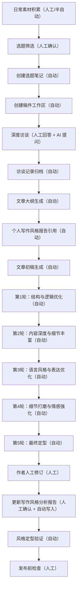

# 我的内容生产流程图

> 复盘范围：Day7-Day10  
> 当前验证案例：《AI 能操作电脑了，但你真的知道它在动哪里吗？》  
> 生成日期：2026-06-08

## 一、完整流程图

## 二、每一步的输入与输出

### 1. 日常素材积累

**参与方式**：人工/半自动

**输入**：

- 日常看到的文章、观点、截图、评论、灵感
- Web Clipper 剪藏内容
- AIHOT 或其他信息源同步内容

**输出**：

- `03-素材库` 或 `04-日常素材` 中的素材笔记

**注意**：

素材不等于选题。素材只是原料，后面还需要结合账号定位和读者痛点筛选。

### 2. 选题筛选

**参与方式**：人工确认

**输入**：

- 素材库内容
- 账号定位
- 当前想写的主题方向

**输出**：

- 确认进入写作的选题
- 选题笔记

**本次案例**：

从“Mac 文件系统”素材出发，确定选题不是普通 Mac 教程，而是“Windows 用户因为 AI 进阶需求购买 Mac，需要理解 Mac 文件、路径和权限逻辑”。

### 3. 创建选题笔记

**参与方式**：自动

**输入**：

- 确认后的选题
- 目标读者
- 文章定位

**输出**：

- `01-选题库/03-行业干货选题池/AI 能操作电脑了，但你真的知道它在动哪里吗？`

**关键字段**：

- 选题标题
- 目标读者
- 核心观点
- 创作状态

### 4. 创建稿件工作区

**参与方式**：自动

**输入**：

- 选题笔记
- 确认后的文章标题

**输出**：

`02-稿件库/01-创作中稿件/AI能操作电脑了但你真的知道它在动哪里吗-20260608`

包含：

- `01-访谈记录`
- `02-文章大纲`
- `03-初稿`
- `04-改稿记录`
- `05-定稿`
- `06-风格定型验证报告`

### 5. 深度访谈

**参与方式**：人工回答 + AI 提问

**输入**：

- 选题方向
- 目标读者
- 作者真实观点

**输出**：

- 完整访谈记录
- 核心观点
- 文章边界
- 读者场景

**本次关键结论**：

- 文章不是讲 Obsidian。
- 文章不是普通 Mac 教程。
- 核心是：AI 能操作电脑后，Mac 小白要理解文件、路径、权限和备份，才能更可控地使用 AI。

### 6. 文章大纲生成

**参与方式**：自动

**输入**：

- 访谈记录
- 确认标题
- 文章定位

**输出**：

- `02-文章大纲`

**大纲逻辑**：

真实场景 → 问题拆解 → 风险判断 → 基础概念 → 安全建议 → 结尾收束

### 7. 写作风格报告引用

**参与方式**：自动

**输入**：

- `00-模板库/我的个人写作风格分析报告`
- 访谈记录
- 文章大纲

**输出**：

- 初稿生成的风格标准

**当前风格标准重点**：

- 短句节奏
- 先共情再转折
- 温和但有边界
- 用普通话解释技术概念
- 判断标准型金句
- 避免 AI 味和教程感

### 8. 文章初稿生成

**参与方式**：自动

**输入**：

- 访谈记录
- 文章大纲
- 写作风格分析报告

**输出**：

- `03-初稿`

**要求**：

- 核心观点必须来自访谈记录
- 不凭空生成新案例
- 不偏离文章边界

### 9. 前 3 轮优化

**参与方式**：自动

**第 1 轮：结构与逻辑优化**

输出：

- `03-初稿-第1轮结构逻辑优化`
- `04-改稿记录-第1轮结构逻辑优化`

重点：

- 调整段落顺序
- 强化结构递进
- 避免内容混乱

**第 2 轮：内容深度与细节丰富**

输出：

- `03-初稿-第2轮内容深度优化`
- `04-改稿记录-第2轮内容深度优化`

重点：

- 补充具体场景
- 让读者更容易代入
- 增强可执行建议

**第 3 轮：语言风格与表达优化**

输出：

- `03-初稿-第3轮语言风格优化`
- `04-改稿记录-第3轮语言风格优化`

重点：

- 减少说明书感
- 调整短句节奏
- 保持公众号长文语气

### 10. 后 2 轮优化

**参与方式**：自动

**第 4 轮：细节打磨与情感强化**

输出：

- `03-初稿-第4轮细节情感优化`
- `04-改稿记录-第4轮细节情感优化`

重点：

- 加入读者心理
- 强化真实场景
- 让文章更有温度

**第 5 轮：最终定型**

输出：

- `03-初稿-第5轮最终定型`
- `04-改稿记录-第5轮最终定型`
- `05-定稿`

重点：

- 收紧表达
- 减少 AI 痕迹
- 形成可人工修订的最终稿

### 11. 作者人工修订

**参与方式**：人工

**输入**：

- `05-定稿`

**输出**：

- 作者亲自确认后的最终定稿

**检查维度**：

- 哪些话不像自己会说
- 哪些表达太空、太套、太 AI
- 哪些细节需要补充真实感受
- 金句是否真的像自己会说的话
- 结尾是否符合自己的发布习惯

### 12. 更新写作风格分析报告

**参与方式**：人工确认 + 自动写入

**输入**：

- 作者人工修订后的最终定稿
- 原有写作风格分析报告

**输出**：

- `00-模板库/我的个人写作风格分析报告`

**更新内容**：

- 开头短句节奏
- 先共情再转折
- 温和但有边界
- 普通话解释技术概念
- 判断标准型金句
- AI 味红线
- 结尾问题清单

### 13. 风格定型验证

**参与方式**：自动

**输入**：

- 作者修订后的定稿
- 更新后的写作风格报告

**输出**：

- `06-风格定型验证报告`

**当前结论**：

文章基本定型，可以进入发布前检查。

### 14. 发布前检查

**参与方式**：人工

**输入**：

- 最终定稿
- 公众号发布要求

**输出**：

- 可发布版本

**检查重点**：

- 标题是否最终确认
- 小标题是否适合公众号阅读
- 是否需要加粗关键句
- 是否有错别字
- 是否有重复表达
- 结尾引导是否符合公众号习惯
- 是否需要封面图、摘要、标签

## 三、哪些步骤适合封装成 Skill

### 1. deep-interview

**适合封装范围**：

从确认选题到完成访谈记录。

**触发场景**：

- “我要开始写一篇新文章”
- “帮我做选题访谈”
- “围绕这个选题问我问题”

**人工参与点**：

- 作者回答访谈问题
- 作者确认标题和文章方向

### 2. style-write

**适合封装范围**：

从访谈记录到初稿和 5 轮优化。

**触发场景**：

- “基于访谈记录帮我写初稿”
- “按我的风格生成文章”
- “继续做 5 轮优化”

**人工参与点**：

- 作者确认初稿是否偏题
- 作者完成最终人工修订

### 3. style-report-updater

**适合封装范围**：

从作者最终修订稿到更新写作风格分析报告。

**触发场景**：

- “我修完定稿了，帮我更新风格报告”
- “根据这篇文章更新我的写作风格”

**人工参与点**：

- 作者确认差异点
- 作者确认是否写入风格报告

## 四、当前流程中最容易出错的地方

1. 没有先确认文章边界，容易把文章写成普通教程。
2. 没有作者访谈，AI 容易凭空补案例。
3. 写作风格报告不更新，后续文章会越来越模板化。
4. 作者人工修订被跳过，文章会停留在“AI 写得还行”，但不像自己。
5. 写入 Obsidian 时要注意 URL 编码，避免空格变成加号。

## 五、下一步建议

建议优先开发第一个个人 Skill：`style-report-updater`。

原因：

1. 这一步流程刚刚跑通，记忆最新。
2. 范围适中，不像“从选题到发布”那么大。
3. 人工确认节点明确，适合做成稳定流程。
4. 它能让你的风格报告随着每篇定稿持续进化。

如果想先开发更常用的写作 Skill，也可以选择 `style-write`，用于把“访谈记录 → 初稿 → 5 轮优化 → 提醒人工修订”封装起来。
