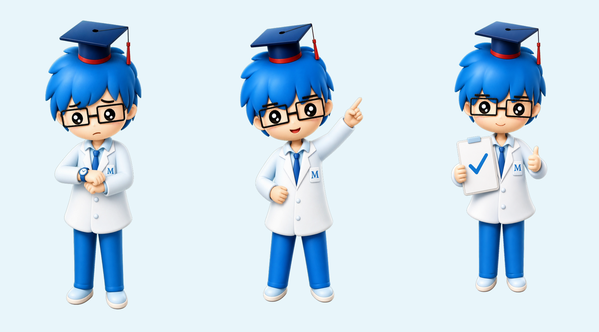
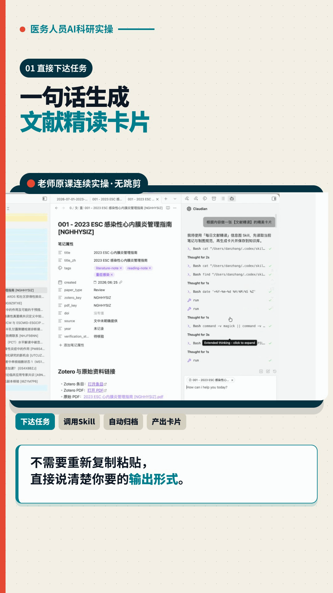
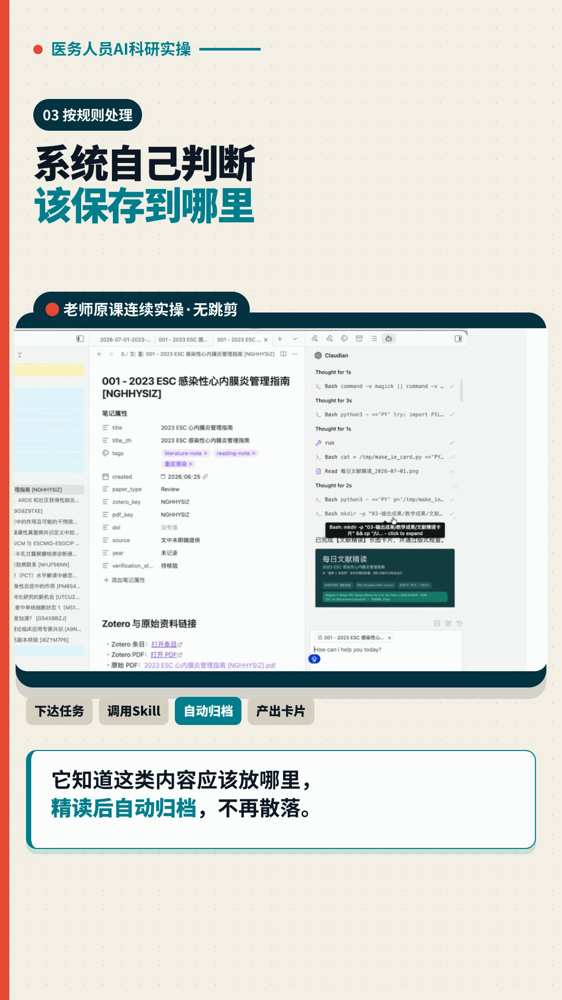
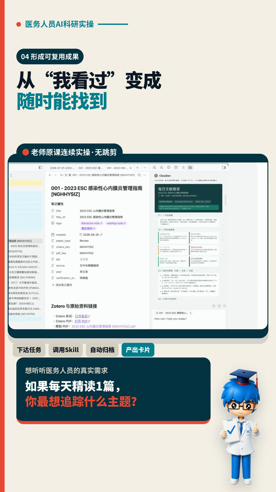
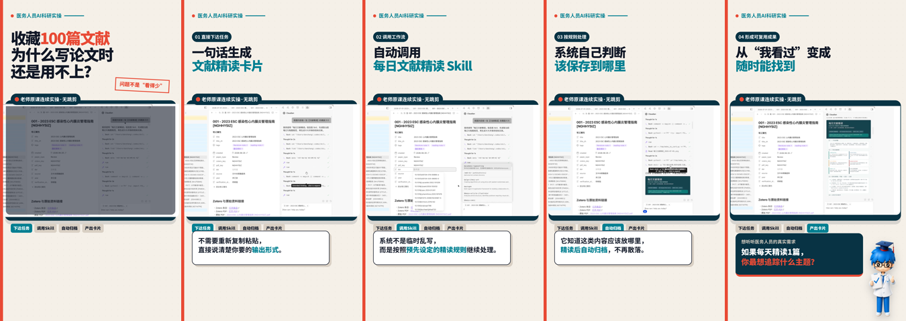

# 我把一张平面IP交给Codex，它居然变成了短视频角色

最近在做一条课程短视频时，我突然想到一件事：

**公司明明已经有自己的IP形象，为什么每次做视频，最后还是只会在角落里贴一个Logo？**

Logo只能告诉别人“这是谁家的内容”。

但IP形象如果用对了，可以替你表达焦虑、提示重点，还能在结尾帮你完成互动引导。

于是我做了一次尝试：把原来的平面IP交给AI，先改成统一的3D形象，再生成不同动作，最后把它放进课程视频里。

结果比我预想的有意思得多。

更让我觉得有意思的是，这次我没有先打开PS、AE，再一层一层慢慢做。

我直接把原始IP图和视频目标交给Codex，告诉它：

> 把这个形象做成适合课程视频的3D角色，保留原有识别特征，再根据视频情节生成几套动作，最后放进竖屏视频里，但不要遮挡课程内容。

接下来，它分几步完成了整套工作：

1. 读取原始IP图，识别不能被改掉的特征。
2. 生成3D基础形象和不同动作。
3. 整理透明底、绿幕版和预览图。
4. 读取视频结构，判断IP应该出现在哪个节点。
5. 把角色放进视频时间线，调整大小、位置和入场动画。
6. 先输出预览，我看完提出意见，再生成最终成片。

我需要做的，主要是提供原图、说明使用场景，以及检查结果。

这和以前“自己打开软件，一步一步点完所有按钮”的制作方式，已经很不一样了。

## 第一步：先锁住IP的“身份证”

把一张平面图变成立体图不难，难的是：**变完之后，大家还能不能一眼认出它。**

这次我要求AI必须保留几个核心识别点：

- 蓝色头发
- 黑框眼镜
- 博士帽和红色帽穗
- 白大褂、蓝色领带
- 胸前的“M”标识
- 亲切、专业、偏医学科研的气质

如果这些特征被随意改掉，即使图片更“高级”，它也已经不是原来的品牌IP了。

我后来把要求整理成了一段可复用的提示词：

> 请在不改变角色核心识别特征的前提下，把这张平面IP形象转换成精致的3D卡通角色。保留发色、眼镜、博士帽、白大褂、领带和胸前标识；比例可爱但不要幼儿化；材质柔和，适合医学、科研和教育类内容。背景保持干净，角色完整，不裁切手脚。

这里最重要的一句不是“做成3D”，而是：

**不改变核心识别特征。**

## 第二步：不要只生成一张，要直接做成“动作资产包”

如果只有一张站立图，它最后还是会变成另一个Logo。

所以我继续给这个IP补了三种状态：

1. **焦虑看表**：适合表达赶时间、任务没完成、用户痛点。
2. **抬手指向**：适合提示重点、解释步骤、引导视线。
3. **完成打勾**：适合展示结果、互动提问和结尾收束。

这一步非常关键。

因为视频不是一张海报，它有前后节奏。不同情绪和动作，才能让IP真正参与内容，而不是一直站在旁边“摆拍”。

## 第三步：同时准备透明底和绿幕版

动作做好以后，我没有只保存普通图片，而是同时准备了：

- 透明背景PNG
- 绿幕背景版本
- 浅色背景预览图

透明PNG最省事，可以直接叠在画面上。

绿幕版则更适合剪映等工具：导入图片后使用“色度抠图”，把绿色去掉，就能继续加阴影、动画和缩放。

多准备一个版本，后面会少很多返工。

## 第四步：先想清楚IP在视频里负责什么

真正把IP放进视频时，我没有让它从头站到尾。

这条视频的内容，是展示老师如何把收藏的文献变成可以精读、归档和复用的资料。

首页最重要的是痛点，所以先让大字抓住注意力，不急着放IP。

进入实操以后，画面的主角应该是老师的操作过程。这里如果再放一个大IP，只会挡住信息。

直到结尾出现互动问题，我才让“完成打勾”的IP从右侧进入：

这样它就不是装饰，而是有一个明确任务：

**告诉观众，前面的流程已经走完了，现在轮到你回答问题。**

## 第五步：给它一点动作，但不要抢戏

这次我没有做复杂的数字人口播，也没有让IP一直跳来跳去。

只做了一个很轻的入场动画：

- 从右侧向内移动一小段
- 由小到大
- 透明度从0变成100%
- 用略带弹性的节奏停住
- 整个动作约0.6秒

如果你用剪映，也可以直接选择“入场动画—弹入/滑入”，时长控制在0.5到0.8秒。

**IP动作的作用是吸引一次注意，不是持续抢走注意。**

## 最后成片的结构

整条视频最终是这样的：

1. 首页先抛出用户痛点。
2. 中间连续展示真实课程实操。
3. 用标题和步骤条解释观众正在看什么。
4. 最后出现互动问题。
5. IP在结尾进入，承担“完成+引导评论”的角色。

## 如果你也想试，最小流程只有7步

1. 找到一张你拥有使用权的IP原图。
2. 列出不能改变的识别特征。
3. 用AI生成统一风格的3D基础形象。
4. 补充焦虑、指向、完成等常用动作。
5. 导出透明PNG或绿幕素材。
6. 根据每个视频节点给IP安排任务。
7. 在剪映或其他视频工具里加入轻量入场动画。

不会3D建模，也不需要先做一整套昂贵的角色动画。

**先把一个现成IP变成3个能反复使用的动作，就已经可以让很多视频更有品牌记忆点。**

## 还有一个版权提醒

这套方法适合你自己的品牌IP，或者已经获得明确授权的角色。

如果原始形象不属于你，不能因为“是AI生成的”就默认可以商用。还要确认所用生图工具、字体、图片和音乐是否支持商业使用。

AI降低的是制作门槛，不会自动替你解决版权问题。

以后我还想继续试试：让这个IP做成固定的视频主持人、课程小助手，甚至根据不同选题自动切换动作。

原来一个放在素材库里很久的平面形象，交给AI代理重新拆解之后，真的还能这么用。
