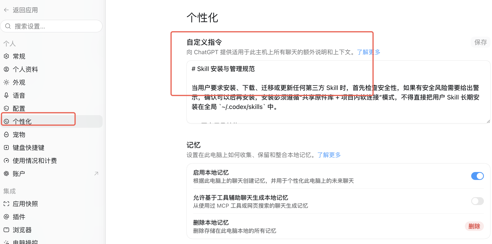

---
tags:
  - "内容阶段/创作中"
  - "主题/AI工具"
  - "主题/WorkBuddy"
---
# AI 是怎么"偷偷"记住你的？（价值精修版）

经常有人问：为什么 WorkBuddy 或 Codex（和 WorkBuddy 类似的 AI 助手）聊着聊着就像认识我了，好像有记忆一样？

说真的，比起"它怎么记住我"，更值得关心的是——你有没有让它记住你。

很多人用 AI 最烦的一点，就是每次新开对话框，都得重新交代"我是做运营的""我喜欢口语化"。像个复读机。其实不用这么累。你只要把"让它懂你"这件事做对，后面就省心了。

而且搞懂它是怎么记的，你往后跟 AI 聊天会顺手很多——最后我会专门说，建议别跳过。

---

说白了，AI 对你的"了解"就来自这几样东西。它们不是三个独立功能，而是同一件事的三个方面：**让 AI 更懂你**。

**第一样，是你主动把底牌亮给它。**

你肯定有过这种体验：刚跟 AI 聊上，它压根不知道你是干啥的，背景、喜好每回都得重说一遍，聊得越长越累。

AI 里有个地方叫"自定义指令"，说白了就是你提前写进去的要求——你是谁、你喜好啥、希望它守哪些规矩。写进去之后，以后每回对话它都照着做，你再也不用复读。在 WorkBuddy 里，入口是「系统设置 → 个性化 → 自定义指令」，Codex 也一样。

![[assets/01-个性化-自定义指令设置页.png]]
codex入口也是一样

文末我放了一段能直接抄进去的话，照着填就行。

**第二样，是它自己从聊天里学你。**

不过光写指令还不够。有些聊出来的小偏好——比如你随口说一句"这个标题我喜欢带点悬念"——指令管不了这种临时冒出来的细节。

好在「系统设置 → 记忆」里有个"生成对话记忆"开关，可以理解成"记住我们聊过什么"的开关。打开后，它会自动从聊天里挑重点：你的偏好、你的习惯。聊得越多，它越懂你。

![[assets/02-记忆-生成对话记忆设置页.png]]

**第三样，是你随时能查、能改它记了啥。**

有时候你可能会犯嘀咕：它记的这些到底藏哪了？靠不靠谱？

最简单的办法，就是在 WorkBuddy / Codex 里直接问一句"你的本地规则文件"。这名字听着唬人，其实就是存在你电脑里的规则小本本，写着它该记啥、怎么做事。它会告诉你都有哪些，看不懂就接着追问，一层一层问下去。

![[assets/03-提问你的本地规则文件对话截图.png]]

说白了，这就是你掌握主动权的入口——能查、能改、能删，不是什么云端黑箱。

---

这三样凑一块，才是完整的"让 AI 懂你"：你主动交代的、它自己学的、加上你随时能纠偏的。

弄完之后，体验差多少？看这张表就明白：

| 之前 | 之后 |
| --- | --- |
| 每次开聊都得重新自我介绍 | 一打开它就懂你是谁 |
| 聊出来的偏好得反复说 | 它自动从聊天里记下来 |
| 担心它乱记、不知道记了啥 | 一句"你的本地规则文件"就能查个明白 |

---

**搞懂它是怎么记的，对你以后跟 AI 沟通有啥用？**

设完这几样，你可能会想：不就是个记忆功能吗，我设好不就完了？其实搞懂它"怎么记"，比"设了"更重要——因为懂了机制，你后面每次和 AI 聊天都在"养"它，而不是瞎用。具体来说有三个实在好处：

**你会主动"喂"它，不再等它猜。**
知道了自定义指令是常驻规矩、记忆是从聊天里自动挑重点，你第一次聊的时候就会故意把重要偏好说清楚——比如"我写公众号、读者是运营小白、讨厌术语"，因为它会记下来，下回直接生效。含糊带过的人，等于白长了这个功能。

**它犯傻时，你能一秒定位原因。**
哪天它又让你重复背景，你不会莫名恼火，而是马上知道：是记忆开关没开？还是这条没写进我的自定义指令？直接对症修，不跟 AI 生闷气，也不用换个工具重来一遍。

**你心里有底，知道边界在哪、能收能放。**
它记的只有两样：你明说的规矩，加上聊天里它挑的重点。而"本地规则文件"就躺在你电脑上，你能查、能改、能删。知道这点，你既敢放心用，也知道不想要了怎么清。

一句话：不懂机制，你是 AI 的乘客；懂了，你是司机。

---

**拿走就能用：一段能直接抄进自定义指令的话**

下面这段是我自己在用的（脱敏版），你按自己的情况改改，粘进自定义指令框即可：

> 我是做新媒体/运营的，日常用 AI 辅助写文案、做选题、整理资料。请遵守：①用中文、口语化，别堆术语，必要的术语配一句大白话；②给我东西时尽量给"能直接抄"的版本；③记住我的场景和偏好，别每次都让我重新说一遍。

**小结**：AI 的"记忆"不神秘——你主动告诉它的（自定义指令）、它自己从聊天里记的（记忆开关）、加上你随时能查能改的（本地规则文件），凑起来就是"让 AI 更懂你"这件事。做完这几样，你也不用再当复读机了。

关于我：做了 8 年运营，最近一头扎进 AI 里出不来。
这个公众号是我的学习笔记本，写的都是自己真用过的场景——不是什么高大上的概念，就是"这个活儿，AI 到底能不能帮我干"。
看到这里说明咱们是同路人，扫码加个微信，有问题随时来聊 👇

![[assets/个人微信二维码-黎子.jpg]]
