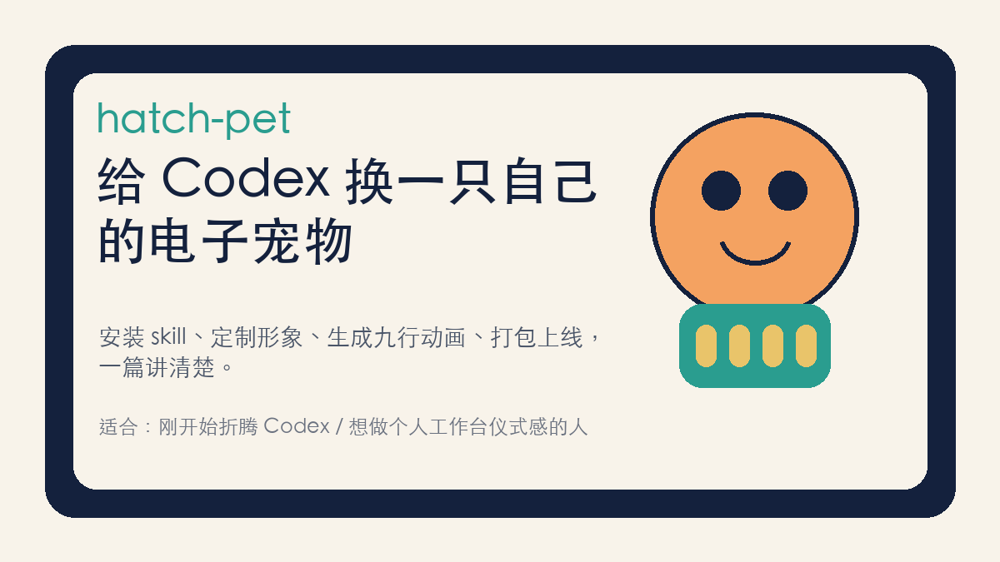
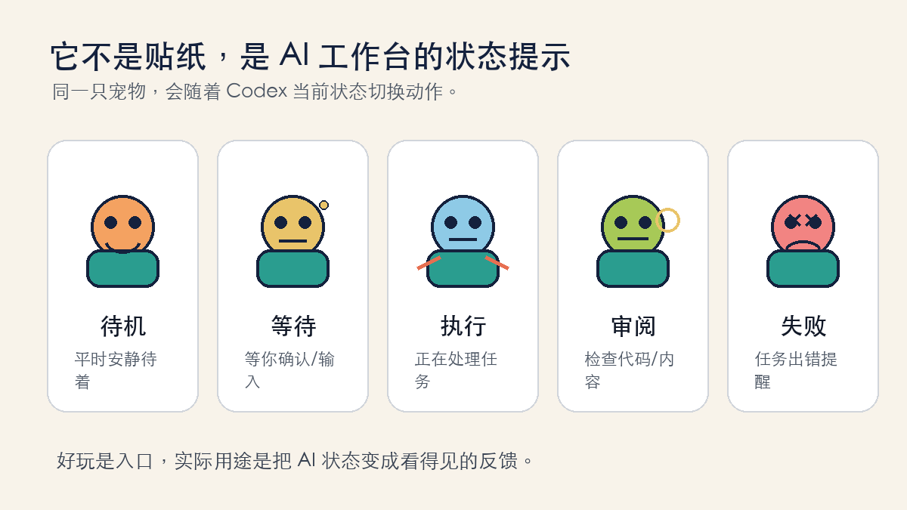
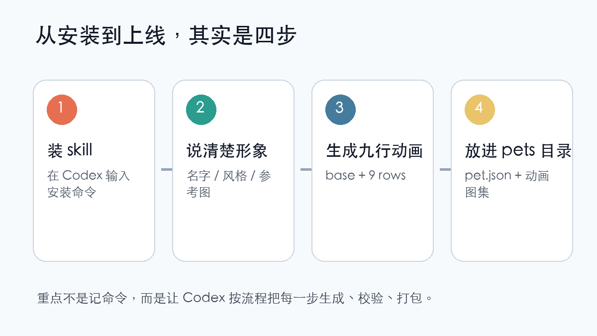
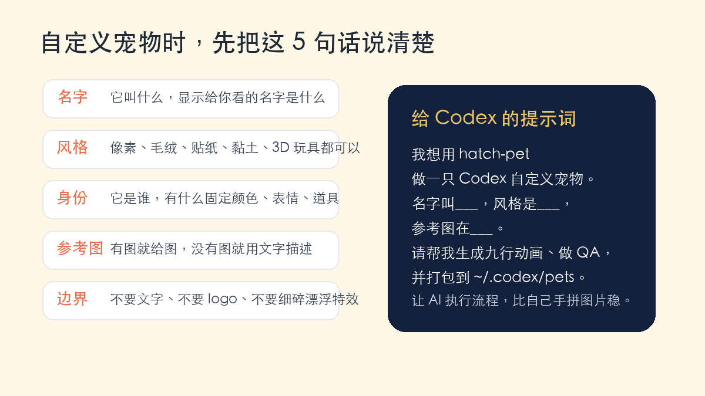
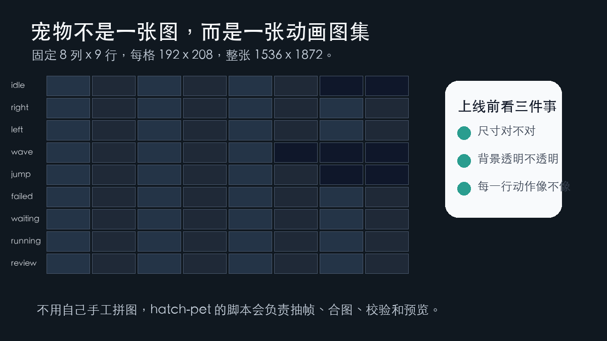

# 运营必备AI工具推荐11：hatch-pet，给 Codex 换一只自己的电子宠物



如果你第一次看到 Codex 里的“宠物”，先别把它想成游戏里的宠物。

它更像一个会动的小状态牌。

平时它安静待着。

AI 正在干活，它会进入执行状态。

需要你确认权限、补充信息，它会变成等待状态。

任务失败了，它会有失败反馈。

进入 review，它又会像在认真检查。

所以这只宠物到底是啥？

**一句话：它是 Codex 工作台里的小动画助手，用来把 AI 当前状态变得更直观。**



## 它只是为了好玩吗？

坦白说，好玩肯定是第一层。

AI 工具用久了，界面大多都很理性：命令、日志、文件、代码、提示词。

突然多一只会跟着状态动的小东西，确实会让工作台有一点陪伴感。

但它不只是装饰。

它至少有三个实际用途。

第一，**状态可视化**。

你不用一直盯着文字日志，也能大概知道 Codex 是在执行、等待你、失败了，还是正在 review。

第二，**降低工具冰冷感**。

很多人刚开始用 AI 编程工具，会觉得它离自己很远。宠物会让这个工作台更像“自己的空间”。

第三，**适合做个人或品牌工作台识别**。

你可以做一只毛绒小助手，也可以做像素风小猫、黏土风机器人、品牌感吉祥物。

它不一定提升模型能力。

但它会提升你打开工具、持续使用工具的意愿。

**工具被你改造成自己的样子以后，你会更愿意每天打开它。**

## 如果我也想做，最简单怎么开始？

不要一上来研究底层文件。

新手先记住一件事：

`hatch-pet` 是帮你做 Codex 宠物的 skill。

你只要告诉它想要什么样的宠物，它会帮你把后面那套生成、校验、打包流程跑起来。

最简单的开始方式，是在 Codex 里输入：

```text
$skill-installer hatch-pet
```

安装完成后，重启 Codex。

一般它会装到这里：

```text
~/.codex/skills/hatch-pet
```

如果安装时遇到网络、证书、下载失败之类的问题，不要急着自己查半天。

你可以直接对 Codex 说：

```text
安装 hatch-pet 时下载失败了，请改用 git 方式安装。
```

这类问题很多时候不是你操作错了，而是本地网络或证书环境不顺。

**小白不要在这里硬扛。让 AI 换安装方式，往往更快。**



## 做自己的宠物，重点是先描述清楚

你不需要会画画。

但你要把需求说清楚。

如果你只是想试一只自己的宠物，可以直接复制下面这段：

```text
我想用 hatch-pet 给 Codex 做一只自定义宠物。

宠物名字：请叫它「小工友」
风格：毛绒玩具风，干净、可爱、不要复杂细节
形象：一只圆圆的小助手，主色是浅绿色和奶白色，表情认真但不严肃
动作要求：按 Codex 的 9 行状态完整生成
注意：不要文字，不要 logo，不要漂浮特效，不要背景，最后帮我做 QA 并打包到 ~/.codex/pets
```

如果你有参考图，可以再加一句：

```text
参考图在：/你的/图片/路径/reference.png，请尽量保留它的颜色和整体气质，但不要直接复制文字或 logo。
```

如果你想做品牌感宠物，可以这样说：

```text
请先做轻量品牌调研，只提取颜色、气质、产品隐喻，不要复制 logo、标语、界面截图或可识别文字。
```

这里有个小提醒：

宠物不是海报。

它最后会被缩到很小的格子里，所以不要一开始就堆很多复杂细节。

真正重要的是：

- 轮廓要清楚
- 表情要稳定
- 颜色要统一
- 道具不要太碎
- 不要有文字、logo、漂浮特效
- 每个动作看起来还是同一只宠物



## 可以做成什么风格？

`hatch-pet` 不是只能做像素风。

它支持很多宠物安全风格，比如：

- `pixel`：像素风
- `plush`：毛绒玩具风
- `clay`：黏土风
- `sticker`：贴纸风
- `flat-vector`：扁平矢量风
- `3d-toy`：3D 玩具风
- `painterly`：绘本风
- `brand-inspired`：品牌灵感风
- `auto`：让它自动判断

如果你没有特别明确的想法，我建议先用 `auto`。

新手最容易犯的错，不是风格不够特别。

而是风格太复杂，最后缩小以后什么都看不清。

## 接下来再讲一点底层：它为什么不是一张图？

前面你已经知道它是什么、有什么用、怎么开始做。

现在再看底层就更容易理解。

Codex 的宠物不是一张静态图片。

真正被 Codex 读取的，是一个“宠物包”。

通常放在：

```text
~/.codex/pets/<你的宠物名字>/
```

里面至少有两个文件：

```text
pet.json
spritesheet.webp
```

`pet.json` 像一张身份证，告诉 Codex：

- 这个宠物的 id 是什么
- 显示名字叫什么
- 简短描述是什么
- 动画图集文件在哪里

`spritesheet.webp` 才是真正的动画图。

你可以把它理解成一整张“动作大拼图”。

Codex 会按固定位置读取里面的每一个小格子，然后播放成动画。

## 九行动画是怎么回事？

Codex 读取宠物动画时，格式是固定的。

整张图集尺寸是：

```text
1536 x 1872
```

它由 `8` 列、`9` 行组成。

每一个小格子是：

```text
192 x 208
```

9 行分别对应不同状态：

| 状态 | 它在表达什么 |
| --- | --- |
| `idle` | 平时安静待着，轻微呼吸或眨眼 |
| `running-right` | 向右移动 |
| `running-left` | 向左移动 |
| `waving` | 打招呼 |
| `jumping` | 跳起 |
| `failed` | 任务失败或出错 |
| `waiting` | 等你确认、等你输入 |
| `running` | 正在处理任务，不是字面意义的跑步 |
| `review` | 正在检查、思考、审阅 |



这也是为什么我不建议你自己手工拼。

因为你不只是要画一只宠物。

你还要让它在 9 种状态里保持同一个样子，同时保证尺寸、透明背景、动作帧都对。

**自定义宠物最难的地方，不是生成图片，而是让每一格都能被 Codex 正确读取。**

## 真正执行时，Codex 会做哪些事？

你不用记住所有脚本。

但你最好知道它大概在做什么。

正常流程是这样：

1. 准备一个运行目录。
2. 写入宠物名称、描述、风格和参考图。
3. 生成基础形象，也就是这只宠物的“标准长相”。
4. 基于标准长相，生成 9 行动作。
5. 把每行动作拆成单帧。
6. 合成 `spritesheet.webp`。
7. 校验尺寸、透明背景、空白格、动作帧。
8. 生成 contact sheet 和 GIF 预览，方便检查。
9. 打包成 `pet.json` 和 `spritesheet.webp`。

对小白理解就是：

你只负责说清楚想要什么。

Codex 负责把它变成应用能识别的“标准宠物包”。

## 如果你想看命令，大概长这样

这一段不是让你手敲。

只是让你知道它背后不是玄学。

```bash
SKILL_DIR="${CODEX_HOME:-$HOME/.codex}/skills/hatch-pet"

python "$SKILL_DIR/scripts/prepare_pet_run.py" \
  --pet-name "小工友" \
  --description "一只陪你工作的 Codex 小助手" \
  --pet-notes "毛绒玩具风，浅绿色和奶白色，圆润、认真、不要文字和 logo" \
  --style-preset plush \
  --output-dir "/你的/运行目录"
```

等所有图像生成和 QA 都通过后，再打包到：

```text
~/.codex/pets/小工友/
```

里面至少应该有：

```text
pet.json
spritesheet.webp
```

如果这两个文件缺一个，Codex 就很可能读不到它。

如果图片尺寸不对，或者背景不是透明的，也可能显示异常。

## 最后上线前，我建议你检查 5 件事

1. 宠物缩小以后还看得清吗？
2. 9 行动作是不是同一只宠物？
3. `idle` 状态是不是安静，不会一直大幅晃动？
4. `waiting`、`running`、`review` 三个状态能不能区分？
5. `pet.json` 和 `spritesheet.webp` 是否在同一个宠物目录里？

这几件事比“第一眼惊艳”更重要。

因为宠物是长期挂在工作台上的。

它不需要像海报一样复杂。

它需要稳定、清楚、舒服。

## 最后说一句

我觉得 `hatch-pet` 有意思，不只是因为它可爱。

而是因为它背后其实代表了一种新的 AI 工具玩法：

先用 AI 生成内容，再用固定规则把内容变成应用能读取的资产，最后用校验流程保证它真的可用。

这比“随便生一张图”更进一步。

它开始接近一个小型生产线。

你不用一开始就做得很复杂。

先装好 `hatch-pet`。

再用一句清楚的提示词，做一只简单、稳定、能看清的小宠物。

等你跑通一次流程以后，再慢慢调风格、调表情、调品牌感。

先让它活起来。

后面再让它长得更像你。

我是

**黎子**

专注 **AI+运营** 提效。

每天进步一点点，让 AI 为你打工。

关注我，争取早日退休。
