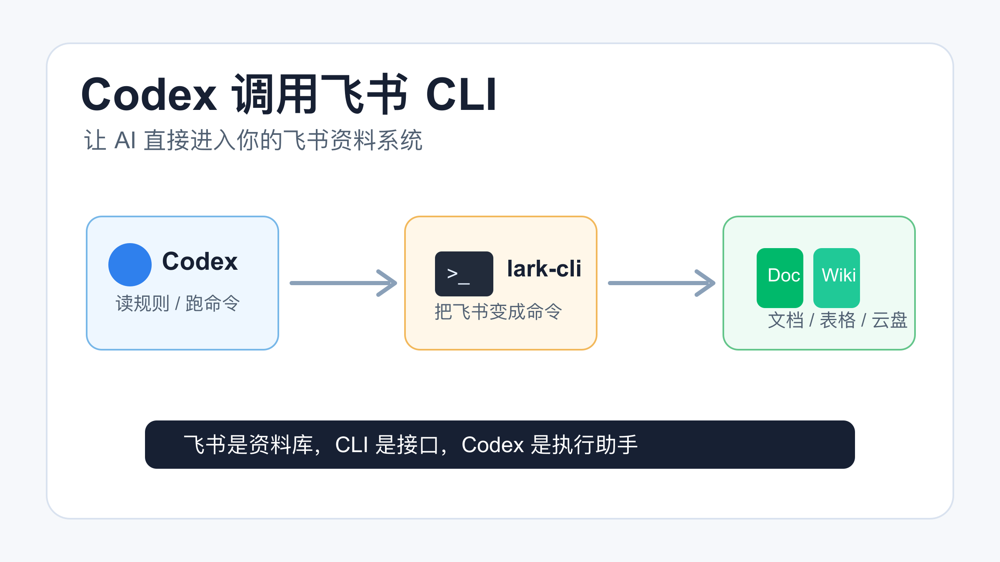
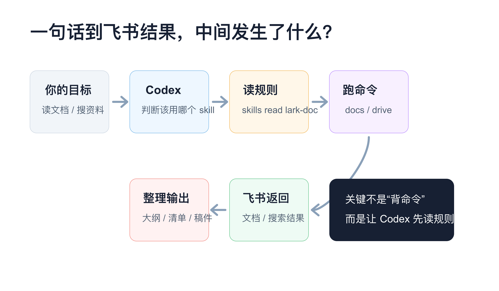
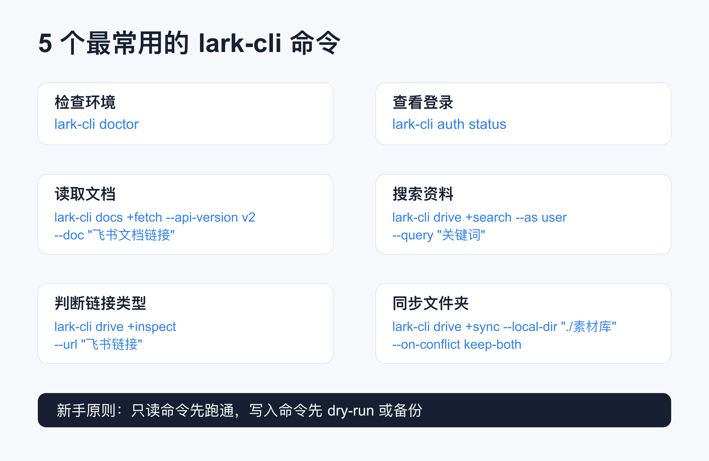
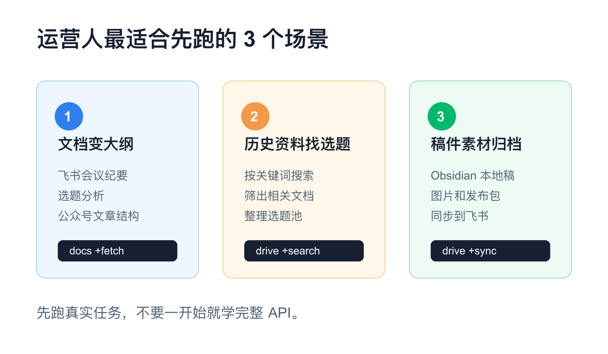
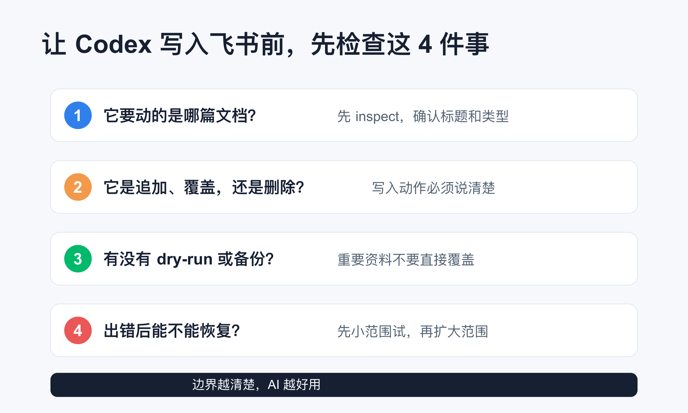

---
tags:
  - "内容阶段/初稿"
所属项目: "[[02-稿件库/01-创作中稿件/Codex调用飞书CLI公众号文章-20260615/00-项目索引|Codex 调用飞书 CLI]]"
上一步: "[[02-稿件库/01-创作中稿件/Codex调用飞书CLI公众号文章-20260615/02-文章大纲|02-文章大纲]]"
下一步: "[[02-稿件库/01-创作中稿件/Codex调用飞书CLI公众号文章-20260615/04-改稿记录-精简优化版|04-改稿记录-精简优化版]]"
---
# AI 不只会写代码：我让 Codex 直接调用飞书 CLI，资料整理快了很多



很多人用飞书存资料。

会议纪要在飞书。

选题表在飞书。

项目文档也在飞书。

但一到用 AI 写东西、整理资料、做复盘的时候，还是回到最原始的方法：

复制。

粘贴。

再复制。

再粘贴。

这件事看起来没什么问题。

但如果你的资料越来越多，问题就会很明显：AI 很强，可它碰不到你的真实工作资料。

所以我最近越来越常用一个组合：

**Codex + 飞书 CLI。**

简单说，就是让 Codex 通过 `lark-cli` 去读取、搜索、导出、同步飞书里的资料。

不是让你手动学一堆 API。

而是让 AI 按规则去调用命令。

## 先说结论



你可以把这件事理解成三层：

| 层级 | 负责什么 | 普通话解释 |
| --- | --- | --- |
| 飞书 | 存资料、协作、沉淀文档 | 你的工作资料库 |
| `lark-cli` | 把飞书能力变成命令 | 让电脑能用命令操作飞书 |
| Codex | 读规则、跑命令、整理结果 | 替你执行和归纳的助手 |

飞书是资料库。

CLI 是接口。

Codex 是执行助手。

真正值钱的地方不在于“我会敲命令”。

而在于你可以直接对 Codex 说：

```text
读取这篇飞书文档，整理成公众号文章大纲。
```

或者：

```text
搜索我最近 7 天编辑过的飞书文档，帮我整理本周选题池。
```

它就能先判断该用哪个飞书 skill，再调用对应的 `lark-cli` 命令，最后把结果整理成你能直接用的内容。

## 它到底能做什么？

别一上来想太复杂。

对运营人和内容人来说，先记住这 5 类就够了。



### 1. 读取飞书文档

这是最常用的。

比如你给 Codex 一个飞书文档链接，让它读完后总结、提纲、改写、拆选题。

常见命令大概长这样：

```bash
lark-cli docs +fetch \
  --api-version v2 \
  --doc-format markdown \
  --doc "飞书文档链接"
```

注意，这里不是建议你每次自己敲。

更适合的方式是让 Codex 帮你跑。

你只要说清楚目标：

```text
读取这个飞书文档，按公众号选题角度总结重点。
```

### 2. 搜索飞书资料

如果你不确定资料在哪篇文档里，可以让它搜索。

```bash
lark-cli drive +search \
  --as user \
  --query "关键词" \
  --doc-types docx,wiki,sheet \
  --page-size 10
```

这个很适合找历史素材。

比如你之前写过“语音输入”“AI 运营”“工作流”，但忘了放在哪个飞书文档里。

让 Codex 搜，再让它筛。

比自己翻文件夹快很多。

### 3. 查看链接到底是什么类型

飞书链接有时候很绕。

可能是文档。

可能是 Wiki。

可能是表格。

也可能是云空间文件。

这时可以先 inspect。

```bash
lark-cli drive +inspect \
  --url "飞书链接"
```

它会帮你判断类型、标题和 token。

这一步很实用。

因为 AI 后面选错命令，很多时候就是一开始没判断清楚对象类型。

### 4. 同步本地文件夹和飞书云空间

如果你有本地素材库，也想和飞书云空间同步，可以看 `drive +sync`。

```bash
lark-cli drive +sync \
  --local-dir "./素材库" \
  --folder-token "飞书文件夹 token" \
  --on-conflict keep-both
```

我建议新手一开始不要直接覆盖。

冲突策略可以先用 `keep-both`。

先保留两份，再人工确认。

### 5. 写回飞书文档

当你让 Codex 整理完内容，也可以让它追加回飞书文档。

```bash
lark-cli docs +update \
  --api-version v2 \
  --doc "飞书文档链接" \
  --command append \
  --doc-format markdown \
  --content @整理结果.md
```

但这一步要谨慎。

读取是低风险。

写回就是改资料。

重要文档不要一上来就让 AI 覆盖。

## 一个正确的使用顺序

很多人用 CLI 容易卡住，不是因为命令太难。

而是顺序错了。

我更建议按这个顺序来：

```bash
# 1. 看 CLI 是否正常
lark-cli doctor

# 2. 看是否已经登录
lark-cli auth status

# 3. 第一次使用先登录
lark-cli auth login

# 4. 让 Codex 先读对应 skill
lark-cli skills read lark-doc

# 5. 再执行具体文档命令
lark-cli docs +fetch --api-version v2 --doc "文档链接"
```

这里最容易忽略的是第 4 步。

`lark-cli` 自己就提示：AI agent 在执行 docs 命令前，应该先读匹配的内置 skill。

这不是仪式感。

这是为了让 Codex 知道当前版本的参数、格式和风险边界。

换句话说：

**不要让 Codex 硬猜飞书命令。先让它读规则，再让它动手。**

## 运营人最适合先跑这 3 个场景



### 场景一：把飞书文档变成公众号大纲

你开完会，飞书里有一篇会议纪要。

以前的做法是复制到 AI 对话框里，再让它总结。

现在可以直接说：

```text
读取这篇飞书会议纪要，提炼出 5 个适合公众号写作的选题，每个选题给标题、核心观点和读者收益。
```

Codex 先读文档，再整理输出。

你不用在多个窗口之间搬运文字。

### 场景二：从历史资料里找选题

很多运营人的素材不是没有。

是散。

飞书群、飞书文档、周会纪要、临时灵感，全都散在不同地方。

这时可以让 Codex 搜关键词：

```text
在我的飞书文档里搜索“AI 工作流”，找出最近相关资料，整理成一个选题池。
```

它可以先用 `drive +search` 找，再按标题和摘要筛。

你做的是判断。

它做的是翻资料。

### 场景三：把本地稿件同步到飞书归档

如果你像我一样用 Obsidian 写稿，本地会有很多 Markdown。

飞书又适合团队协作和归档。

这时可以把本地发布包同步到飞书文件夹。

适合做：

- 稿件归档
- 图片素材归档
- 发布记录归档
- 每周内容复盘归档

这类活不难。

但很碎。

正适合交给 Codex 跑。

## 跑之前，先看这张安全表



我建议你把飞书 CLI 操作分成两类。

第一类是读。

比如读取文档、搜索资料、查看文件信息。

这类风险相对低。

第二类是写。

比如更新文档、同步文件夹、删除文件、改权限。

这类一定要慢一点。

尤其是让 Codex 执行写入操作前，先问自己 4 个问题：

1. 它要动的是哪篇文档？
2. 它是追加、覆盖，还是删除？
3. 有没有 `dry-run` 或备份？
4. 出错后能不能恢复？

这不是不信任 AI。

而是把边界讲清楚。

边界越清楚，AI 越好用。

## 我最推荐的新手提示词

如果你刚开始，可以直接复制这段给 Codex：

```text
我想让你通过 lark-cli 操作飞书。

请先检查 lark-cli 是否可用，再读取匹配的 lark skill。
如果只是读取资料，优先用只读命令。
如果涉及写入、覆盖、删除、同步，请先解释你准备执行的命令和风险，不要直接动手。

我的目标是：
读取这篇飞书文档，整理成公众号文章大纲。

文档链接：
<粘贴飞书文档链接>
```

这段提示词的重点不是礼貌。

而是把规则说清楚：

- 先检查环境。
- 先读 skill。
- 读写分开。
- 写入前先确认。
- 输出要服务你的真实任务。

## 最后说一句

我觉得 Codex + 飞书 CLI 最有价值的地方，不是“高级”。

而是它终于把很多人每天都在做的碎活接起来了。

以前你要在飞书、浏览器、AI 对话框、Obsidian 之间来回搬运。

现在可以变成：

你说目标。

Codex 找资料。

`lark-cli` 调飞书。

最后结果回到你的稿件、表格或文档里。

你不需要一开始学完整套飞书 API。

先跑通一个真实任务就够了。

比如：

**读取一篇飞书文档，整理成一篇公众号大纲。**

这一步跑通以后，你会突然发现：

AI 不是只能帮你写几段话。

它也可以开始进入你的工作资料系统。

我是 **黎子**，专注 **AI+运营** 提效。每天进步一点点，让 AI 为你打工。关注我，争取早日退休。
