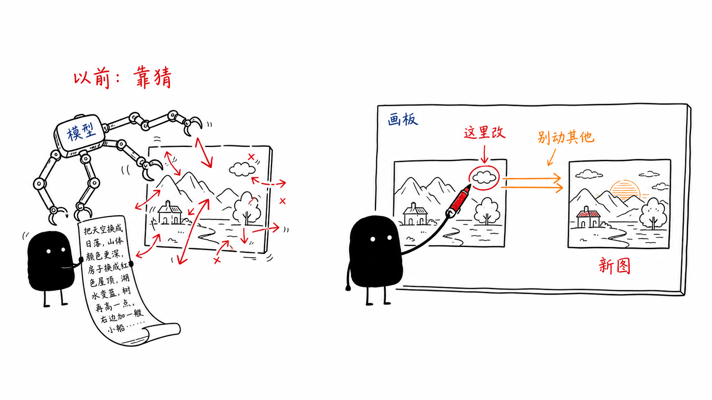
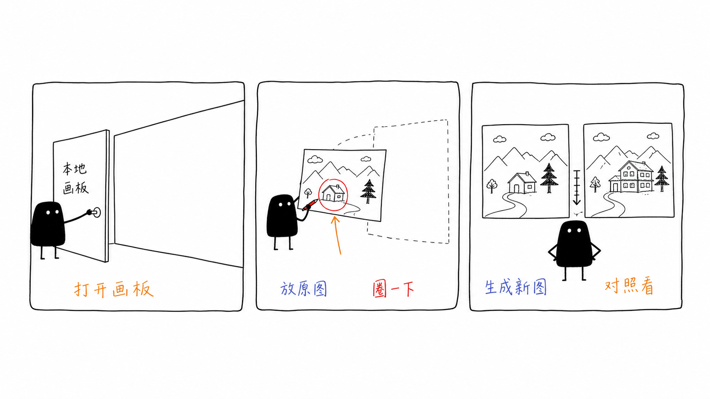
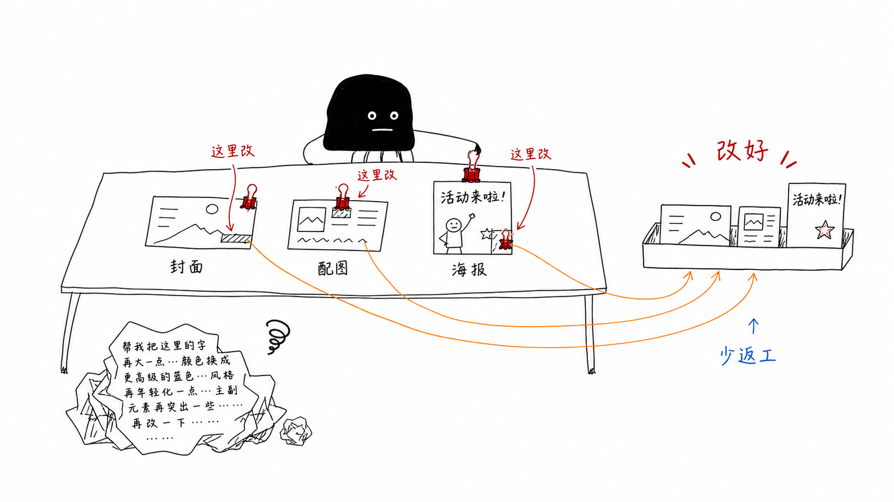
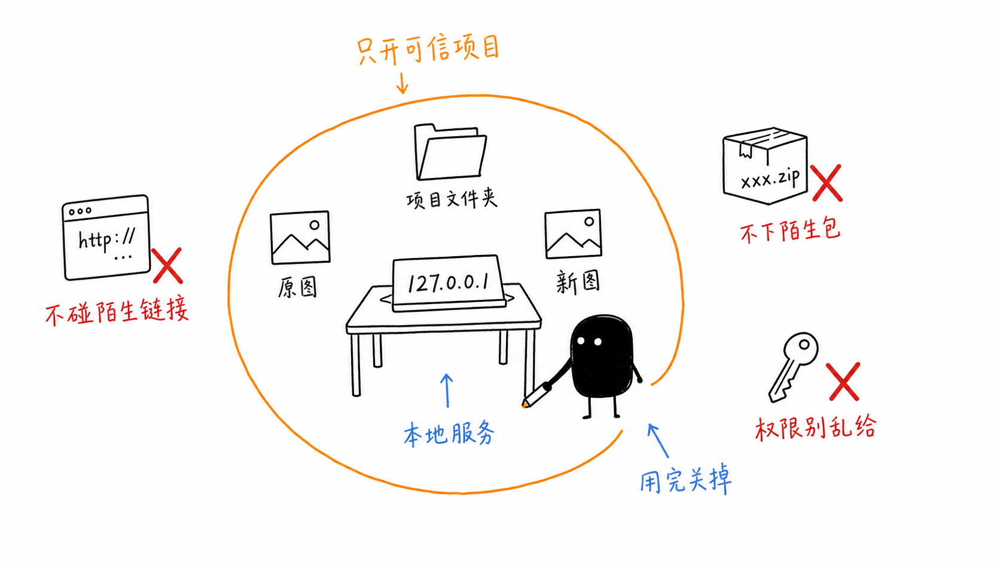

# AI 改图总是改错位置？我最近装了 Cowart，终于找到原因了

最近我装了一个 Codex 里的小工具：Cowart。

体验完之后，我最大的感受不是：

哇，又多了一个 AI 画图工具。

而是：

**AI 改图这件事，缺的可能不是更长的提示词，而是一块可以指给它看的画板。**

如果你用 AI 改过图，应该很熟悉这种崩溃：

你只想改右下角一行字。

它顺手把整张图风格都换了。

你只想让标题大一点。

它把背景、人物、颜色一起重画了。

你说“左边那个小图标挪一下”。

它可能理解成“把整个左半边重新设计一下”。

你越解释越长。

模型越改越远。

最后你开始怀疑：

到底是我没说清楚，还是它根本看不懂我在说哪里？

我这次试 Cowart，真正被打动的就是这一点。

它让“我说的是哪里”这件事，变得可见。

## 一、Cowart 解决的不是生图问题，而是“指向问题”

现在能生成图片的工具太多了。

但运营人、内容人真正头疼的，往往不是从 0 生成一张图。

而是：

一张图已经 80 分了。

我只想把剩下 20 分改好。

比如：

- 公众号封面右下角太挤
- 正文配图里某个元素太抢眼
- 海报里的活动标题要换一句
- AI 生成图整体不错，只想修一个局部
- 封面构图没问题，但某个按钮位置不舒服

这些需求，如果只靠文字描述，很容易变成一大段绕口令：

“请保持整体风格不变，只修改右侧第二个框里的文字，把颜色调淡一点，不要改变左边人物，不要改变背景，不要改画面比例……”

写到最后，人已经累了。

模型还不一定听懂。

Cowart 的价值就在这里。

它不是替代所有设计工具。

它更像是在 Codex 旁边放了一块白板。

你把图放上去。

圈一下。

画个箭头。

写一句短备注。

然后告诉 Codex：

就改这里。

其他不要动。

这时候，AI 收到的不再只是一段抽象文字。

它看到的是一个更明确的视觉上下文。

一句话总结：

**对话框适合说需求，画板适合指位置。**

这就是 Cowart 最有意思的地方。

## 二、不要把它理解成“又一个画图工具”

我之前写 Obsidian 和飞书的时候，有一个判断：

飞书不是不好。

飞书适合团队协作。

Obsidian 适合个人沉淀、长期复用、让 AI 更稳定地读取素材。

不是谁替代谁。

而是不同工具应该放在不同位置。

Cowart 也一样。

它不是 Photoshop。

不是美图秀秀。

不是 Canva。

也不是一个完整设计平台。

它更适合放在 AI 工作流里的一个中间环节：

**把你的视觉反馈，翻译成模型更容易理解的标注。**

官方介绍里，Cowart 是一个面向 Codex 的本地无限画布插件，基于 tldraw 做画布，可以用来做视觉构思、图片标注、AI 图片生成和根据标注图迭代图片。

普通人不用记这么多词。

你只要理解成：

它让 Codex 多了一块本地画板。

你可以在这块画板上放图、圈图、对比图。

然后让 AI 根据这些标注去改。

## 三、真实使用流程，其实就五步

我建议你不要一上来就拿正式封面测试。

先拿一张不重要的图试。

整个流程大概是这样：

**第一步，打开 Cowart 本地画板。**

它会在本地启动一个画布页面。

官方文档里默认地址类似：

`http://127.0.0.1:43217/`

你可以简单理解成：这是开在你自己电脑上的一个本地页面。

**第二步，把原图放进去。**

可以是你已有的公众号配图。

也可以是 AI 生成出来但还不满意的图。

还可以是一个活动海报草稿。

**第三步，在图上圈出要改的位置。**

这个动作很关键。

不要写一堆大段说明。

最好只写短句：

这里改。

字小一点。

颜色淡一点。

别动背景。

保留构图。

**第四步，把标注截图交给 Codex。**

让它根据标注生成干净的新图。

这里的重点是：

标注只是给 AI 看的。

最后生成的新图，不应该保留你的红圈和箭头。

**第五步，把原图和新图放在一起对比。**

不要只看新图好不好看。

要看它有没有遵守你的边界：

有没有只改你圈的位置？

有没有乱动其他地方？

有没有把原本好的部分也改坏？

这里建议插入你的真实截图 1：

【截图位：Cowart 画板里，原图 + 红圈标注 + 箭头】

这里建议插入你的真实截图 2：

【截图位：原图和生成后的新图放在一起对比】

这两张截图很重要。

公众号读者看工具文，最怕只看到概念。

真实截图不需要太精修。

保留一点操作痕迹，反而更可信。

## 四、对运营人来说，它最适合这几类场景

如果你是做运营、内容、公众号、小红书、电商图文的，我觉得 Cowart 最适合的不是“从零做大片”。

而是减少返工。

**1. 改公众号封面**

封面经常不是整张都不好。

而是某个地方别扭：

标题压得太满。

人物挡住字。

按钮太靠边。

右下角信息太乱。

这种时候，画板标注比文字描述更自然。

你直接圈出来：

这里留白多一点。

这里别挡标题。

这里换成更清楚的字。

**2. 改正文配图**

正文配图最怕“整体有感觉，但局部不准”。

比如你写的是 AI 工作流，图里却出现了不相关的元素。

比如你想表达“人工检查”，结果图里画得像“自动完成”。

这时候不用重做整张。

先圈出偏掉的地方，让 AI 做局部修正。

**3. 改活动海报**

活动海报经常要来回调细节。

时间。

地点。

二维码。

价格。

报名按钮。

这些都很适合用“圈注 + 对比”的方式来改。

**4. 做视觉方案草稿**

有时候你还没有最终图，只是想把一个想法表达出来。

比如：

一个课程转化页结构。

一个社群运营流程。

一个内容分发路径。

一个 AI 工作流说明图。

你可以先在画板上画得很粗糙。

再让 Codex 帮你整理成更干净的版本。

这不是为了画得专业。

而是为了把脑子里的想法先落到画面上。

**5. 做版本对比**

我很喜欢它能把原图、标注、新图放在同一个画板里。

因为内容人经常不是要一张图。

而是要比较：

哪一版更适合正文？

哪一版更适合封面？

哪一版适合朋友圈？

哪一版看起来不像 AI 味？

这些图如果散落在下载文件夹里，很快就乱了。

放在画板里，一眼能看出修改过程。

## 五、但是 Windows 用户，不建议无脑装

工具好用是一回事。

安全边界是另一回事。

我查了一圈资料，目前没有看到 Cowart 本身有什么公开重大漏洞通告。

但它属于一种“本地服务 + 插件 + MCP 工具 + 项目文件”的组合。

这类工具不是普通网页。

也不是装完就不用管的小游戏。

Cowart 的画板数据会保存在当前项目的 `canvas/` 目录下。

本地保存本身是好事。

至少它不是默认把你的素材全扔到一个陌生云端平台。

但只要一个工具能在本地开服务、读项目文件、通过 MCP 和 Codex 交互，就应该把边界讲清楚。

微软安全团队今年也写过一篇关于 AI agent 和本地服务风险的文章，里面有一个很重要的提醒：

当一个 agent 既能浏览外部内容，又能访问本机上的本地服务时，localhost 就不能再被简单当成天然安全边界。

翻译成人话就是：

别因为地址里写着 `127.0.0.1`，就觉得它一定没有风险。

尤其是 Windows 用户。

很多新手装工具时，最容易一路点：

允许。

下一步。

管理员权限。

确认。

最后工具跑起来了。

但自己也不知道它到底获得了哪些权限。

这才是我真正担心的地方。

## 六、如果你要试，建议先按这 5 条来

**第一，只在可信项目里打开。**

不要在一堆陌生下载包、乱七八糟的代码文件、客户资料混在一起的文件夹里启动。

你可以专门建一个干净文件夹，比如：

`AI配图实验/`

只把要测试的图片复制进去。

**第二，不要把陌生网页和本地画板混在一起。**

如果你正在让 agent 浏览陌生网站，就不要同时让它操作本地画板和项目文件。

这不是说一定会出事。

而是没有必要把风险叠在一起。

**第三，能不用管理员权限就不要用。**

如果安装过程里突然要求管理员权限，先停一下。

问清楚：

它要装什么？

它要写哪里？

为什么需要这个权限？

内容工具原则上不应该动不动就要系统级权限。

**第四，用完就关掉本地服务。**

很多本地工具开起来以后，你以为关了网页就结束了。

但服务可能还在后台跑。

用完后，最好确认终端里的服务已经停止。

如果你不知道怎么查，至少做到：

只在需要的时候打开。

不用的时候退出相关会话和本地服务。

**第五，不要拿敏感素材测试。**

客户合同。

身份证。

内部数据。

未公开活动方案。

账号密码截图。

这些都不要放进去试。

先拿普通配图、公开素材、低敏感图片练手。

边界越清楚，风险越低。

## 七、我会怎么用它

如果让我把 Cowart 放进自己的内容工作流里，我不会把它当成“万能设计工具”。

我会把它放在三个位置：

**第一，AI 图生成后的局部修改。**

图整体不错，只改一个小地方。

这时候最适合用 Cowart。

**第二，公众号配图发布前检查。**

哪里拥挤、哪里不清楚、哪里和正文意思不一致，直接圈出来。

**第三，做视觉想法草稿。**

不是为了画得多好。

而是先把想法摆出来，再让 AI 帮我整理。

它真正节省的，不是一次生成图片的时间。

而是你反复解释、反复返工、反复说“不是这里”的时间。

我对 Cowart 的态度是：

值得试。

但不要神化。

它不是设计师。

也不是自动修图神器。

它更像一个“让 AI 看懂你手指指向哪里”的协作工具。

对运营人来说，这已经很有价值了。

因为我们每天要处理的，不只是文字。

还有封面、配图、海报、流程图、截图说明、活动页面。

未来的 AI 工具，不会只比谁更会聊天。

还会比谁更懂你的操作意图。

文字是一种表达。

截图是一种表达。

画圈、箭头、批注，也是一种表达。

Cowart 有意思的地方，就是把这种表达接进了 Codex 的工作流里。

最后再说一句：

**AI 工具越强，越要知道它在动哪里。**

Cowart 的好处是，它让“动哪里”变得可见。

而我们的责任是，把“能不能动、该不该动、动完怎么检查”也一起想清楚。

我是

**黎子**

，专注**

AI+运营

**提效。  
每天进步一点点，让AI为你打工。

关注我，争取早日退休

参考资料：

- Cowart GitHub 项目：https://github.com/zhongerxin/Cowart
- Cowart Canvas Skill：https://github.com/liyujinyu/cowart-canvas-skill
- Microsoft Security Blog：AutoJack: How a single page can RCE the host running your AI agent
- Eye Security：From Helper To Risk Factor: Why AI Canvases Deserve Executive Attention
