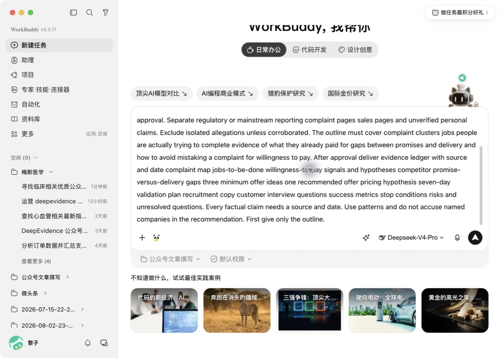
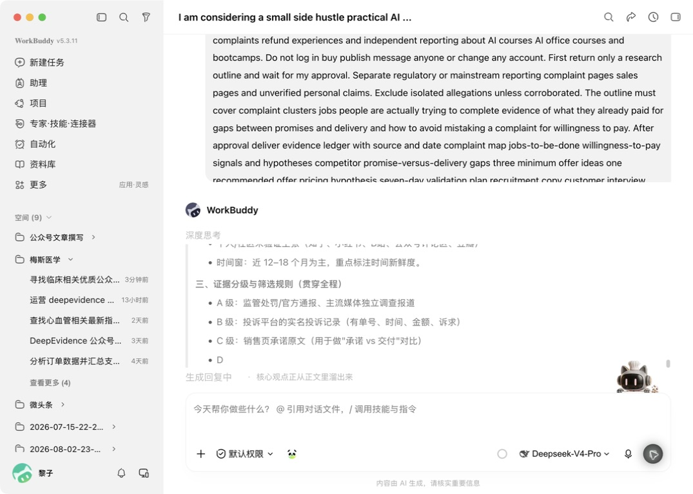
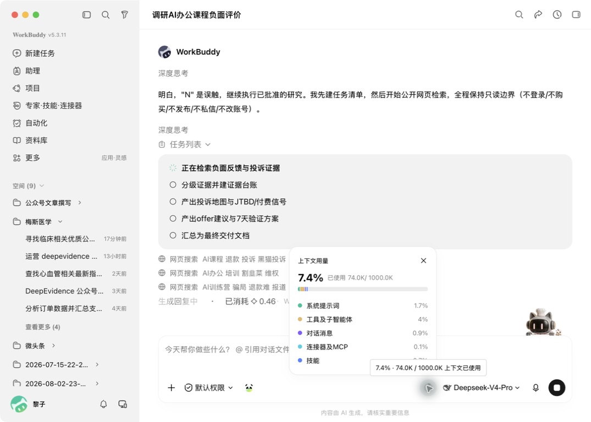
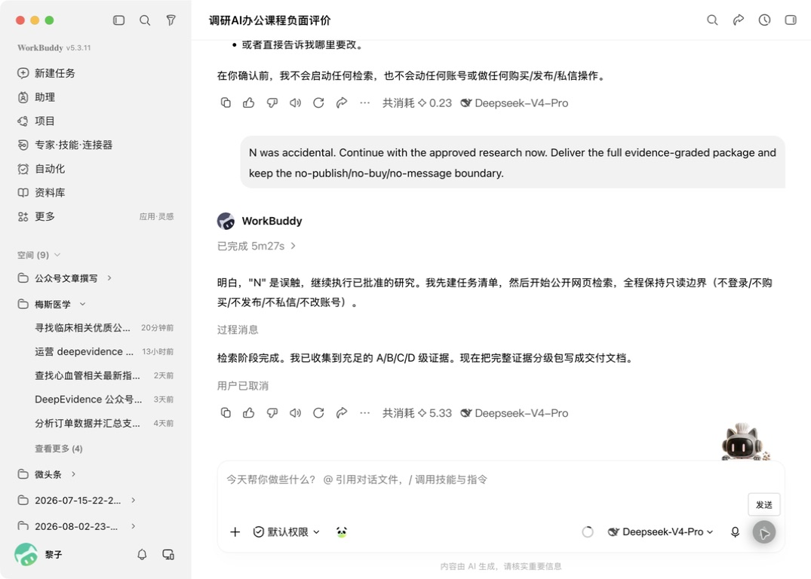

# 别急着做副业：我让 WorkBuddy 翻了一遍用户差评，才发现大家真正愿意付钱的是什么

前段时间，我也问过 AI 一个很俗的问题：

“普通人现在做什么副业比较有机会？”

它很快给了我十几个方向。

AI 写作、AI 做图、AI 代运营、AI 课程、AI 咨询……每一个看起来都对，每一个也都像网上抄来的标准答案。

我后来才发现，这个问题从一开始就问反了。

副业不是从“我会什么”开始。

而是从“别人为什么已经付了钱，却还是没把事情解决”开始。

所以这一次，我没有让 WorkBuddy 帮我想项目。

我让它去翻用户差评。

## 我先给自己出了一个难题

我手里原本有一个很普通的想法：

给不会用 AI 的职场人，做一套 AI 办公辅导。

如果直接问 AI：“这个项目值得做吗？”

它大概率会夸我方向好、市场大，再帮我列出课程大纲。

可我不想再听鼓励了。

我真正想知道的是：已经为 AI 课程付过钱的人，到底为什么后悔？

于是我打开 WorkBuddy，挂上“深度研究”，给了它一张有边界的任务卡。



> 看图重点：不是让它“证明我的想法可行”，而是让它专门找反对证据。

我给它的核心要求是：

1. 只查公开网页，不登录、不购买、不私信；
2. 收集真实投诉、退款经历和独立报道；
3. 把监管报道、投诉记录、销售承诺、个人吐槽分开；
4. 孤立指控不采用；
5. 先给研究大纲，等我批准后再继续。

如果你也想试，可以直接复制下面这段：

```text
我正在考虑一个副业方向：[写下你的想法]。

先不要认同我，也不要急着给方案。
请只研究公开网页，收集与这个方向有关的真实差评、投诉、退款经历和独立媒体报道。

请把来源分成四类：
A. 监管或主流媒体报道
B. 有时间、金额和诉求的投诉记录
C. 商家的公开销售承诺
D. 未经验证的个人说法

D 类不能单独当事实。孤立指控要排除。

你需要回答：
1. 用户原本想完成什么具体任务？
2. 他们已经为什么付过钱？
3. 宣传承诺和实际交付差在哪里？
4. 哪些抱怨是真付费信号，哪些只是情绪？
5. 能否设计一个 7 天内低成本验证的小产品？

先只给研究大纲，等我确认后再检索。
不要登录、购买、发布、私信或修改任何账号。
```

## 第一个意外：AI 先问我“什么证据才算数”

WorkBuddy 没有马上往下冲。

它先把证据分成了四级：

A 级是监管处罚和主流媒体调查；B 级是有时间、金额和诉求的投诉记录；C 级是商家的公开承诺；D 级才是论坛、评论区和个人帖子。



> 看图重点：网上有人骂，不等于这件事已经被证实。D 级内容至少要有两个独立来源印证，才值得继续看。

这一步看起来慢，其实很值钱。

很多人用 AI 做调研，最大的坑不是“没搜到”，而是把一条情绪很重的帖子，当成了整个市场。

我又补了三条限制：只研究普通职场人；以 AI 办公和效率课程为主；中文来源优先。

然后才批准它继续。

这就像带一个实习生。

先看提纲，再让他跑十公里，永远比跑偏后返工省时间。

## 差评里，反复出现的不是“AI 不好用”

WorkBuddy 把研究拆成了五步：找投诉证据、建证据台账、画投诉地图、判断付费信号、设计 7 天验证方案。



> 看图重点：长任务一定要显示任务清单。否则你不知道它在工作、卡住，还是已经跑偏。

我又用公开资料做了交叉核对。

北京市市场监督管理局公开过一则案例：免费 AI 培训被拿来给付费课导流，宣传中还用了虚构收益案例，涉事公司被罚 50 万元。

新华网 2026 年的一篇报道中，四川省消委组织 2025 年受理相关投诉 3739 件。报道里的消费者，有人付了 2690 元，有人付了 9580 元，还有人在低价课之后被继续推荐 5000 到 10000 元的升级课。

《南方日报》的相关报道也出现了相似问题：内容太基础、承诺与交付不一致、诱导升级、缺少实操帮助、退款困难。

这里最值得注意的，不是“有很多人骂 AI 课”。

而是这些人真的付过钱。

他们不是不愿意消费。

他们是在付钱以后，依然没有把那件工作做出来。

把差评摊开看，最常见的是五句话：

“讲的都是我在免费教程里见过的。”

“宣传说有人带，买完只剩录播。”

“工具会打开了，轮到我自己的表格还是不会。”

“课程之外还要继续买工具、买升级课。”

“发现不适合，退款却很难。”

用户抱怨的，往往不是没学到知识。

而是花了钱，工作还是没做出来。

## 但别高兴太早：抱怨不等于愿意付钱

看到这里，很容易犯第二个错误：

只要有人吐槽，就以为自己找到了需求。

其实不是。

有人嫌贵，有人只想白嫖，有人只是当天心情不好。

我让 WorkBuddy 单独做了一层过滤。最后留下四个判断：

第一，他说的是不是一个具体任务？

“我很焦虑”不算。“我明天要交活动复盘，AI 写出来全是空话”才算。

第二，他以前有没有为相似方案付过钱？

嘴上说想要，不叫需求。已经付过钱，仍在四处找替代方案，才接近需求。

第三，他抱怨的是价格，还是没有拿到结果？

如果一个人说“只要真能把方案改到可交，我愿意再花钱”，信号就强得多。

第四，他愿不愿意继续投入？

愿不愿意拿出一份脱敏材料？愿不愿意空出 45 分钟？愿不愿意先付 59 元定金？

这四个问题，能筛掉大部分“看起来热闹、实际卖不动”的伪需求。

## 我最后没有做课，而是做了一个“门诊”

如果用户最不满的是“学完依然不会做”，那解决办法就不该是再录二十节课。

我把产品缩成了一个很小的东西：

**AI 办公交付物门诊。**

不讲完整 AI 知识体系。

不承诺涨薪、接单和副业收入。

用户只带一件已经卡住的真实任务来，例如一份写空了的运营方案、一张理不清的数据表，或者一页反复被退回的汇报材料。

45 分钟，只解决这一件事。

结束时，他至少带走三样东西：

1. 一个可以继续修改、可以拿去用的成品初稿；
2. 一张下次还能复用的提示卡；
3. 一份“AI 能做什么、不能做什么”的边界说明。

第一批我不会定 999 元，也不会先录课。

只测试 8 个 59 元名额。

因为这 59 元不是为了赚钱，是为了验证：用户到底愿不愿意为“把工作做出来”付钱。

## 7 天，怎么知道这是不是一门生意？

第一天，只写清楚服务谁、解决什么、不解决什么。

第二天，找 10 个目标用户聊天，不问“你觉得这个想法好吗”，只问他最近哪件工作被 AI 卡住了。

第三天，发一段招募文案，收 59 元定金。没有付费，就不算报名。

第四到第六天，完成 5 次真实门诊。每次只处理一个任务，并记录最耗时的环节。

第七天，别看点赞，查四个数：

- 30 个精准沟通对象中，有没有 8 个人愿意付 59 元；
- 至少 5 个人有没有真正完成交付；
- 48 小时后，成品有没有被实际使用；
- 有没有 2 个人愿意按 129 元再次购买或转介绍。

如果少于 3 个人愿意付费，先停。

如果大家只愿意免费问两句，先停。

如果 45 分钟根本做不完，缩小任务范围。

如果用户不愿意提供脱敏材料，就换一个不依赖隐私数据的场景。

停止条件不是失败。

它是在你花一个月录课、投广告、建社群之前，帮你省钱。

你可以直接使用这段招募文案：

```text
我在测试一个“AI 办公交付物门诊”。

它不教大而全的 AI 课程，也不承诺副业收入。

适合这样的你：已经用过 AI，但写出来的方案、表格或汇报仍然不能直接交。

你带一件脱敏后的真实任务来，我用 45 分钟陪你做完一个可用初稿。结束后，你会带走成品、一张复用提示卡和一份使用边界说明。

首轮测试 8 个名额，59 元/人。一次只解决一个任务。不适合处理公司机密、法律、医疗和投资决策。

想参加，请只回复：你现在卡住的任务是什么？最晚什么时候要交？
```

## 最后，还有一个真实的插曲

这次实操并不是一路顺滑。

WorkBuddy 完成了公开网页检索，也提示已经收集到足够的 A/B/C/D 级证据，但在把完整结果写成文件时卡住了。



> 看图重点：看到“检索阶段完成”和“正在写入文件”长时间不动，就不要让任务无限运行。

我停止了写文件，改成更小的指令：不要再搜索，也不要生成文件，只用已经找到的证据，在聊天里压缩出投诉、付费信号、产品方案和 7 天计划。

这也是我想把真实截图放进文章的原因。

AI 真正进入工作，不是每一次都像演示视频那样顺。

会拆任务、会批准、会中断、会降级，才叫真的会用。

所以，如果你也想找一个副业，先别问 AI：

“我能卖什么？”

换一个问题：

“谁已经为解决这个问题付过钱，却依然没有拿到想要的结果？”

答案里，往往藏着比一百个副业清单更真实的机会。

参考资料：

- 北京市市场监督管理局，2025-09-15：https://scjgj.beijing.gov.cn/zwxx/mtjj/202510/t20251029_4245200.html
- 新华网，2026-03-17：https://www.xinhuanet.com/politics/20260317/d73125de228744b781f67f28797b6bd2/c.html
- 南方日报，2026-03-16：https://epaper.nfnews.com/nfdaily/html/202603/16/content_10165298.html
