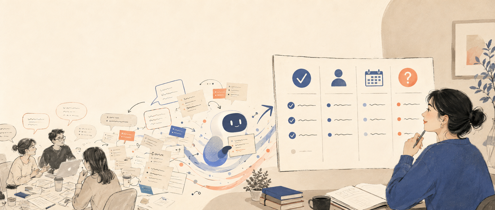

# 会议开完就忘？让 WorkBuddy 把记录变成行动清单



很多会议的问题，不是没有纪要，而是纪要写完以后没人再看。

一大段聊天记录或转写文字里，真正需要我们关心的通常只有几件事：最后决定了什么、谁来做、什么时候完成，还有哪些问题没有说清楚。

这类工作很适合交给 WorkBuddy 做第一轮整理。

我会把会议记录放进一个独立任务，并告诉它：只根据原文提取，不要替参会人补决定。

可以直接复制这段指令：

```text
请根据这份会议记录整理行动清单。

输出四部分：
1. 已经明确的结论；
2. 行动项、负责人和截止时间；
3. 有讨论但没有形成结论的事项；
4. 原文没有说明、需要我补充确认的信息。

要求：
- 不要根据语气猜测负责人或截止时间。
- 没有明确写出的内容统一标记“待确认”。
- 每个关键结论附上对应的原文句子或位置。
- 不修改原始会议记录。
```

整理完成以后，我只需要重点检查责任人、时间和关键决定，再把确认后的行动项发给相关人员。

如果会议包含客户信息、财务数据或其他敏感内容，仍要先确认资料是否适合交给 AI 处理，并限制工作目录和权限。

AI 可以帮我们从长记录里捞出重点，但最后谁负责、什么时候完成，仍然应该由人确认。

真正有用的会议纪要，不是写得完整，而是会推动下一步发生。

资料核对日期：2026 年 9 月 2 日。

---


