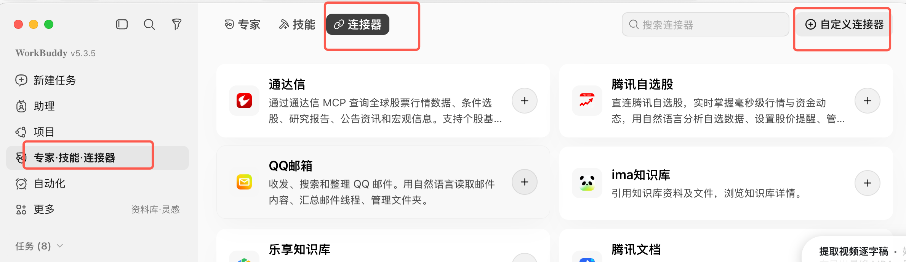
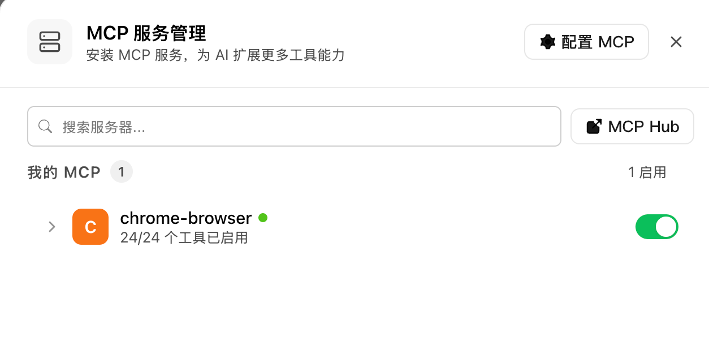
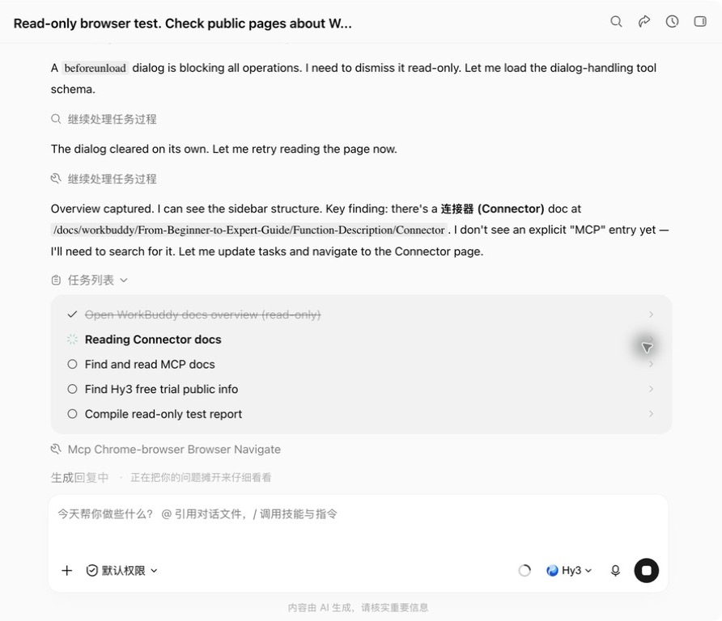
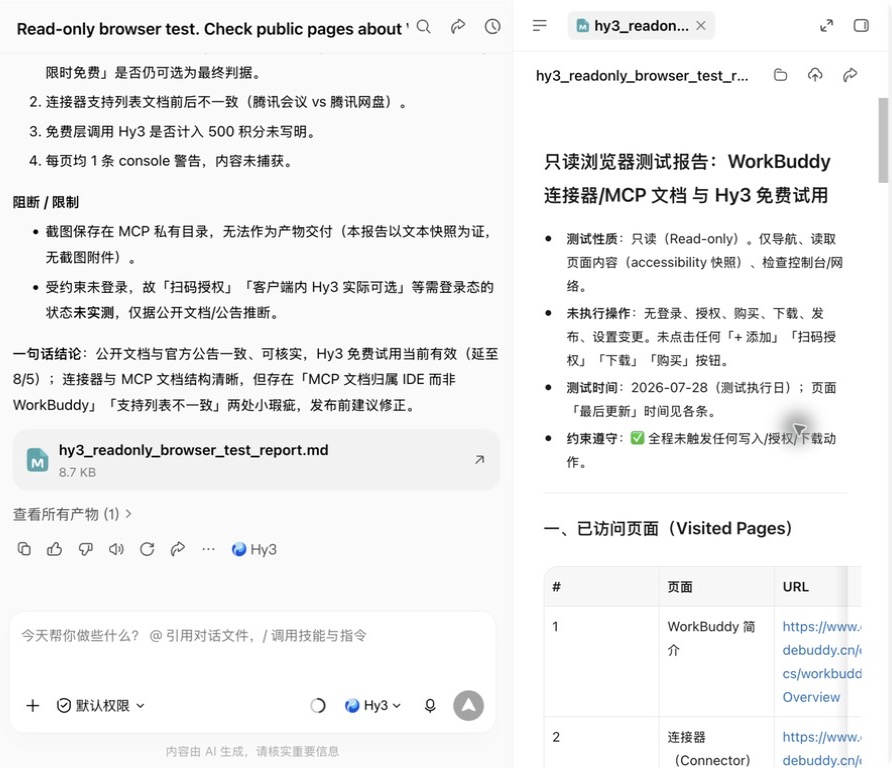

# 我让 WorkBuddy 真跑了一次浏览器任务：能用，但别神化

这几天我在试 WorkBuddy。

最吸引我的不是“它又接了一个新模型”，而是它现在可以通过连接器和 MCP 接上浏览器。

再加上客户端里 Hy3 还在限免，对普通用户来说，确实是一个很适合上手试错的窗口。

但这篇我不想写成产品介绍。

我直接让它跑了一个真实小任务，看它到底能做到哪一步。

## 我先接了浏览器 MCP

我现在用的是 WorkBuddy v5.3.5。

入口在「专家·技能·连接器」里，里面能看到 QQ 邮箱、腾讯文档、ima 知识库等连接器，也有「自定义连接器」。



我这次测的是 `chrome-browser`。

MCP 服务管理里显示：`chrome-browser` 已启用，24/24 个工具已启用。



这一步只能说明一件事：

**浏览器能力接上了。**

但接上不等于好用，所以我继续让它跑任务。

## 实测一：让它只读网页，整理资料

我给它的任务很克制：

```text
只读实测：请用浏览器查看 WorkBuddy 官网和连接器文档，不要登录、不要授权、不要购买、不要修改配置。

输出实际打开的页面、可核验信息、未知点、遇到的卡点，并标注来源。
```

我故意加了四个限制：

- 不登录
- 不授权
- 不购买
- 不改配置

因为 Agent 工具最怕的不是不会做事，而是没边界地替你做事。

这次它实际跑了 3 分 7 秒。

中间它做了几件比较值得注意的事：

1. 先尝试加载 `agent-browser` 技能，发现没装；
2. 没停住，继续检查可用 browser MCP 工具；
3. 打开 WorkBuddy 简介、连接器文档、MCP 文档、定价页、腾讯云 Hy3 相关页面；
4. 遇到一次 `beforeunload` 弹窗阻塞，后来自动恢复；
5. 最后生成了一份 `hy3_readonly_browser_test_report.md`，8.7 KB。



这个过程比我预期好。

它不是只给我一个“看起来很聪明”的回答，而是把自己访问过的页面、核实到的信息、没确认的点都列了出来。

最终报告里，它核到了几件事：

| 它核到的点 | 我的判断 |
| --- | --- |
| 连接器通过 MCP + CLI 或 Skill + CLI 对接外部服务 | 有用，这是理解 WorkBuddy 连接器的关键 |
| WorkBuddy 与 CodeBuddy 同账号积分共享 | 对想试用的人有用 |
| 体验版有 500 积分/月，限免期全模型可选 | 需要以客户端当天显示为准 |
| Hy3 免费体验从 7 月初开始，公开信息显示延长到 8 月 5 日 | 可以写，但要加“以客户端显示为准” |
| WorkBuddy 侧没有单独 MCP 文档，MCP 文档挂在 IDE 文档树下 | 这是一个真实小瑕疵 |



我比较喜欢的一点是：它没有把不确定的东西硬说成确定。

比如它明确写了：

- Hy3 免费是否计入 500 积分，文档没写清；
- 连接器支持列表前后有一点不一致；
- 需要登录态才能确认“客户端内 Hy3 是否实际可选”；
- 它自己的截图保存在 MCP 私有目录里，没法直接作为产物交付。

这类“不知道”其实很重要。

因为做资料整理时，AI 最大的问题不是查不到，而是装作查到了。

这次至少在这个小任务里，WorkBuddy 的报告边界感还可以。

## 实测二：视频号任务能跑，但卡在富文本输入框

做了个任务“上传视频号并定时发布视频”。

它已经做到很后面了：视频上传成功，账号权限正常，时长也识别到了。

但最后卡在视频号的描述输入框。

WorkBuddy 自己给出的解释是：视频号页面的 `contenteditable` 描述框，被前端的“镜像 body”挡住，工具无法稳定定位焦点。

它最后没有硬点发布，而是让人接管：

需要手动点一下描述框，或者手动替换里面的 `test` 文案。

它说明了 WorkBuddy 现在的边界：

**查资料、读网页、整理报告，这类只读任务已经比较顺；但遇到复杂网页后台、富文本输入框、发布按钮、定时发布这种任务，仍然要留人工接管点。**

这不是坏事。

一个靠谱的 Agent，不应该假装自己什么都能自动完成。

该停的时候停下来，把问题说清楚，反而更安全。

## 我现在的判断

WorkBuddy 这次给我的感觉是：

**它不是替代 Claude Code 或 Codex 的东西，而是更偏普通用户入口的办公 Agent。**

它的优势在这几件事：

- 连接器入口更产品化；
- 国内工具适配更自然，比如腾讯文档、QQ 邮箱、ima 知识库；
- Hy3 限免期间试错成本低；
- 只读网页资料整理，可以直接跑出比较完整的报告；
- 结果里能列出未知点，不是一味说自己完成了。

它的问题也很明确：

- 有些文档口径还不够统一；
- WorkBuddy 自己的 MCP 说明不如连接器入口直观；
- 富文本后台、发布类动作仍容易卡住；
- 涉及账号授权、发布、购买、删除，必须人工确认。

所以我不会把它说成“自动办公神器”。

更准确的说法是：

> **如果你想试 AI 进浏览器干活，WorkBuddy 已经能跑一些真实任务了；但最适合先从只读、可检查、可停止的小任务开始。**

## 我建议这样试

不要一上来就让它登录账号、发内容、改配置。

先跑这种任务：

```text
请用浏览器只读查看以下公开页面，整理成一份资料卡。

要求：
1. 标注实际打开的页面；
2. 每条事实给来源；
3. 不登录、不授权、不购买、不下载、不发布；
4. 把不能确认的地方单独列出来。
```

如果这个能稳定跑通，再逐步尝试：

- 整理公开网页资料；
- 对比产品价格页；
- 读取腾讯文档前先看授权范围；
- 生成文章大纲；
- 输出检查清单。

至于发布、删除、购买、授权、群发邮件这些动作，我建议都保留人工确认。

WorkBuddy 能让 AI 更靠近真实工作现场。

但方向盘还是要在人手里。

## 最后

这次实测下来，我会继续用它。

尤其是 Hy3 还限免的时候，很适合拿真实小任务测一测。

不是测它会不会聊天。

而是测它能不能帮你少做一段重复操作。

我的结论很简单：

**值得试，但别神化，先让它读，再让它整理，最后才考虑让它动手。**

