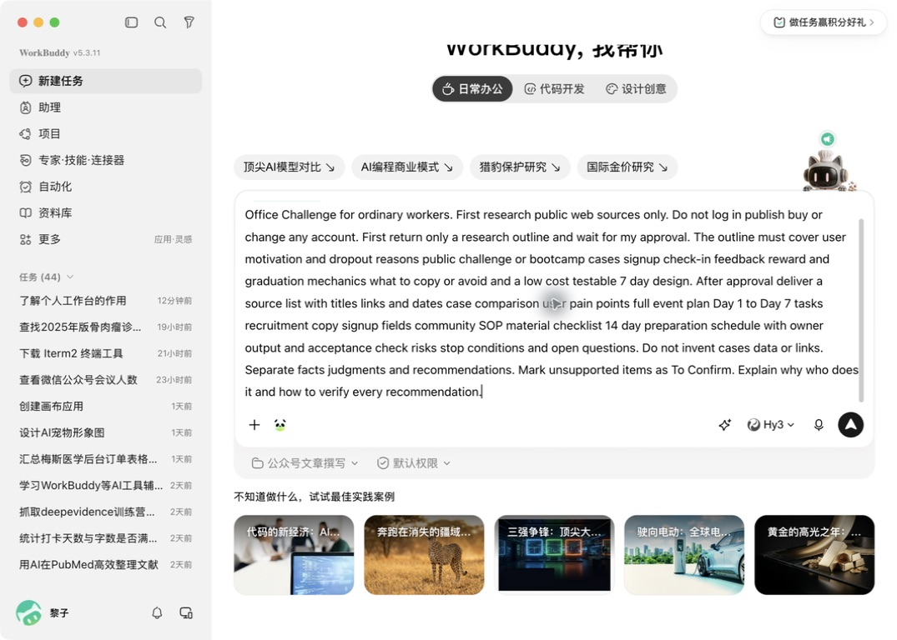
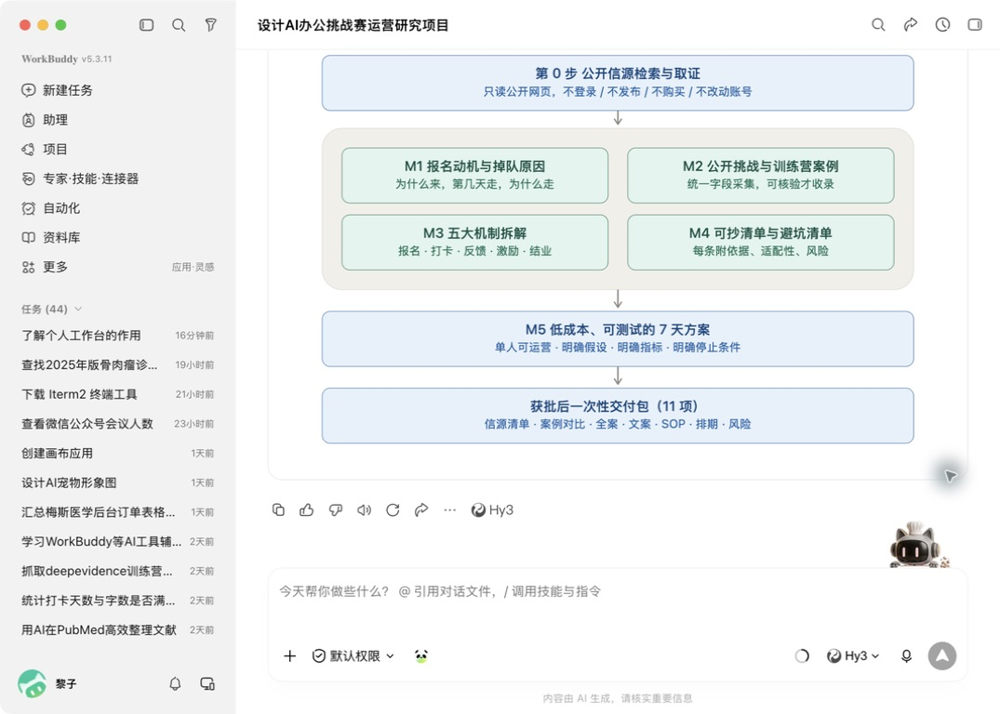
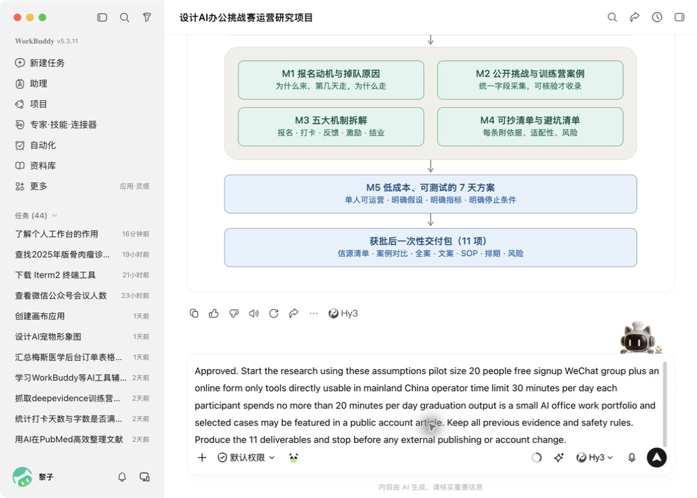
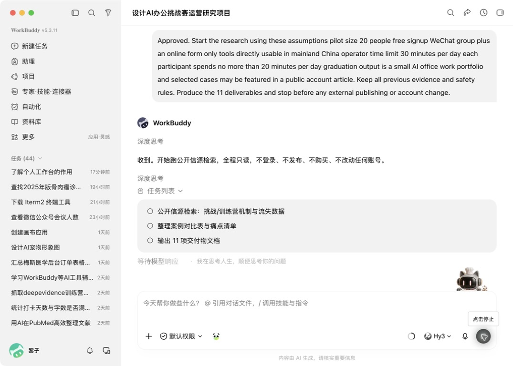
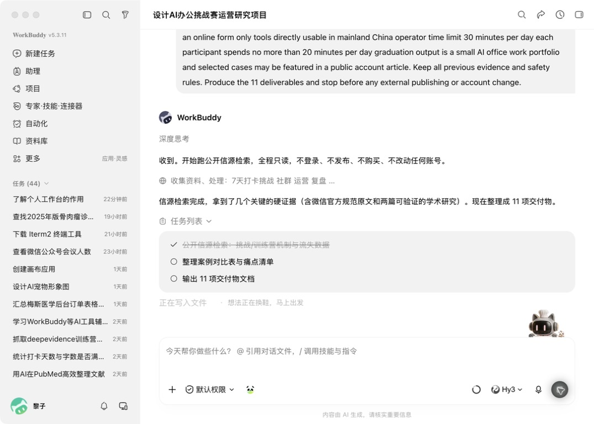
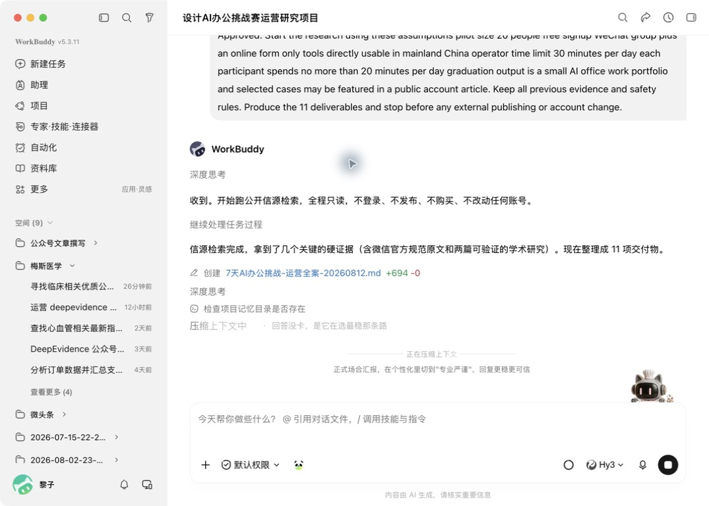
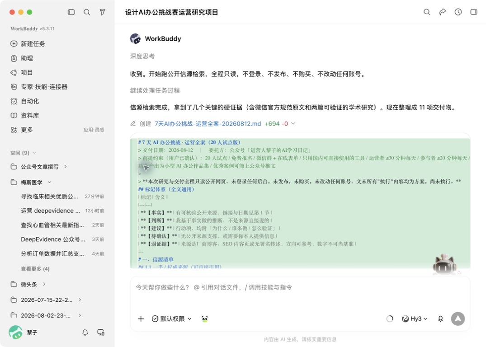

# 老板只说“做个活动”，我让 WorkBuddy 先查案例：方案、SOP、14天排期全拆出来了

做运营的人，大概都收过这种消息：

“下个月做个活动，拉点新用户，你先出个方案。”

就这一句话。

活动做什么、给谁做、多少人、花多少钱、怎么报名、进群以后每天干什么，一样没说。

可两天后，老板就会问：方案好了吗？

以前遇到这种任务，我会先打开十几个网页，看同行活动，抄几张截图，再对着一份空白文档憋标题、流程和时间表。

最后交上去的东西通常很完整：背景、目标、策略、路径，一个不少。

但真要开工，还是会冒出一串问题：报名表收什么？群里第一句话怎么说？有人掉队怎么办？每天谁提醒？海报、话术、表格哪天准备？

这也是我这次真正想测试 WorkBuddy 的地方。

不是让它“帮我写一份活动方案”。

而是看它能不能把老板的一句模糊要求，变成一套有案例、有步骤、明天就能开始做的运营项目。

我选的实操案例是：

> 为 AI 公众号设计一场「7 天 AI 办公挑战赛」。20 人免费试跑，每位参与者每天不超过 20 分钟，运营者每天投入不超过 30 分钟。

这个案例比日报、周报更值得运营学习，因为它同时包含调研、活动策划、内容设计、招募、社群运营和复盘。

而且这次不是纸上谈兵。下面的画面，都是我在桌面 WorkBuddy 里实际跑出来的。

开始之前，我先用飞书 CLI 重读了《WorkBuddy 数字员工实战手册》中与任务卡、深度研究、方案规划、来源核验和人工验收有关的内容。但这篇文章不照着手册目录讲功能，我只用一个真实任务，看这些方法到底能不能落地。

## 第一步，不要让它直接写方案

我打开 WorkBuddy，点击左侧「新建任务」，再选择「深度研究」。

深度研究，你可以把它理解成：先去找资料，再回来回答。它不是只靠脑子里原来记得的东西往下编。

这是我实际挂载「深度研究」并准备提交任务时的画面：



> 看图只看两处：输入框左上方已经挂上「深度研究」；右侧发送按钮点下去以后，任务才会正式开始。图里的英文是我这次实际提交的内容，下面给你准备了可以直接复制的中文版。

我没有只写“帮我策划一个 7 天活动”，而是把任务写成了下面这张卡。你可以直接复制，再把方括号里的内容换成自己的。

```text
我要为一个 AI 公众号设计「7 天 AI 办公挑战赛」。

请先只读公开网页，调研真实存在的挑战赛、训练营和社群打卡案例。
不要登录、发布、购买或修改任何账号。

先只给我研究大纲，等我确认以后再开始正式检索。

大纲必须包含：
1. 上班族为什么报名，为什么中途掉队
2. 公开可核验的挑战赛或训练营案例
3. 报名、打卡、反馈、激励、结业怎么设计
4. 哪些做法可以借，哪些做法不要抄
5. 一套低成本、可以小范围验证的 7 天方案

正式研究完成后，请交付：
来源清单、案例对比、用户痛点、7 天任务、招募文案、报名表字段、
社群 SOP、物料清单、14 天筹备排期、风险与停止条件、待确认事项。

所有事实必须附来源；事实、判断、建议、待确认要分开。
```

这段话里，最重要的不是“7 天挑战赛”，而是这句：

> 先只给我研究大纲，等我确认以后再开始。

很多人觉得这是多此一举。其实它像装修前先看图纸。

墙都砌好了再说厨房位置不对，改起来最贵。AI 也是一样，方向错了，写得越多，返工越大。

## 第二步，把大纲当成一张“点菜菜单”

大约 3 分钟后，WorkBuddy 没有立刻甩给我一篇长报告，而是先给了研究提纲。

它把任务拆成了五块：

- 为什么有人报名、又为什么掉队
- 去公开网页找真实案例
- 拆报名、打卡、反馈、激励和结业机制
- 分清哪些能借、哪些要避开
- 最后才设计一套低成本 7 天方案

更直观的是，它还生成了一张结构图：



> 看图方法：从左往右看。左边先找资料，中间研究四个问题，右边才生成方案。不是一上来就写结论。

如果你不习惯看研究报告，可以这样理解这张图：

大纲像菜单，告诉你等会儿会上哪几道菜；来源像发票，证明这些东西不是凭空来的；最后的方案才是端上桌的菜。

如果菜单都不对，就别急着让厨房开火。

我检查大纲时，重点看了三件事：

1. 它有没有去找真实案例，而不是只讲常识？
2. 它有没有研究“为什么掉队”，而不是只想怎么拉人？
3. 最终有没有 SOP、物料和排期，而不只是一篇方案？

这三项都在，我才让它继续。

## 第三步，AI 问你的问题，比它给的答案更重要

大纲末尾，WorkBuddy 没急着开干，而是反过来问了我 6 个问题：

做 20 人还是 100 人？免费还是收费？用微信群还是其他工具？能不能使用海外 AI？运营者每天能投入多久？结业后给参与者留下什么？

这些看起来都是小问题，却会直接改变整个方案。

比如，100 人活动可以做排行榜；20 人试跑更适合人工观察。每天能投入 3 小时，可以逐条点评；只有 30 分钟，就必须设计统一反馈模板。

我给出的参数是：

- 先做 20 人免费试跑
- 用微信群加在线表单
- 只用中国大陆可直接使用的工具
- 运营者每天最多 30 分钟
- 参与者每天最多 20 分钟
- 结业时得到一份自己的 AI 办公小作品集



> 看图重点：我不是只回复“可以”，而是把人数、费用、工具、每天用时和结业物一次说清楚。

这一段不是在“喂 AI 更多废话”，而是在告诉它现实世界的墙在哪里。

没有这些墙，AI 最爱给你造一座很漂亮、但根本盖不起来的房子。

## 第四步，确认以后，它才真正开始干活

我批准大纲以后，WorkBuddy 把后面的工作拆成三段：

1. 公开信源检索：找挑战赛、训练营机制和流失研究
2. 整理案例对比表与用户痛点
3. 把结果写成 11 项运营交付物



> 看图重点：打钩的是已经完成；空心圆是还没做。老人和孩子也可以把它理解成一张会自己更新的待办清单。

这个画面很重要。

普通聊天式 AI 往往直接给你最终答案。你看不到它查了什么，也不知道哪一步出了问题。

这里的任务列表像快递轨迹：至少能看见它现在是在找资料、整理，还是已经开始写文件。

随后，WorkBuddy 提示公开信源检索完成，找到微信官方规范原文和可核验的研究资料，并开始写入产物。



> 看图重点：第一项已经打钩，下面两项还在继续；上方文字明确说“信源检索完成”。

最后，它生成了一个名为《7天AI办公挑战-运营全案-20260812.md》的文件，共 694 行。



> 看图重点：蓝色是文件名，绿色“+694”表示新写入了 694 行。

我没有看到“文件生成”四个字就收工，而是点开文件继续检查。

预览最上面先写了委托方、目标和安全边界，接着规定了五种标记：事实、判断、建议、待确认和弱证据，下面才进入信源清单。



> 看图重点：绿色区域就是文件预览。先看到规则，再看到“一、信源清单”，说明它没有把结论和来源混成一团。

这一步就像收到一箱货后开箱验货。箱子到了，不代表里面每样东西都对。

同样，检索完成、文件生成，也不等于里面每一句话都自动可信。

AI 能替你找证据，但不能替你免检。

## 第五步，案例不是拿来抄，是拿来拆机制

为了避免只相信一边，我还另外打开公开网页核对了几类真实案例。

我发现，有价值的不是“别人也做过 7 天”，而是别人把参与门槛设计得有多低、每天到底交什么、最后能带走什么。

例如，[AI修炼之路的 7 天挑战](https://yangmao.ai/zh/challenge/)把每日任务分成约 5 分钟的快速版和约 30 分钟的深入版，还有即时 AI 反馈和可展示的作品。

[FutureHumanism 的 7 天 AI 效率挑战](https://futurehumanism.co/pages/challenge/)则把单日任务控制在大约 15 分钟，并强调第 7 天要让一个真实工作流程变得更省力。

[一个 7 天 MVP 挑战案例](https://www.competehub.dev/zh/competitions/urls1cbf921cd8719b3816c39c7e5ffb79b5)用了押金、每日进度和完成后退款来提高约束力。

还有参与者在 [AI Automation Society 的挑战复盘](https://www.skool.com/ai-automation-society/completed-7-day-challenge)里强调，自己不是只看课，而是每天真的完成、发布和复盘一个成果。

这些页面多数是活动方自己的介绍或参与者公开帖，不等于经过独立审计的“效果证明”。所以我只借它们公开可见的机制，不把宣传结果直接当结论。

最后，我留下了四个适合 20 人小试跑的做法：

- 每天只做一个任务，20 分钟内能交作业
- 允许“5 分钟保底版”，忙的人不至于错过一天就彻底放弃
- 每天必须留下一个看得见的工作成果
- 7 天结束后，不发一张空证书，而是得到一个小作品集

我没有照抄“高额奖金”“复杂排行榜”和“逐人长点评”。不是它们一定不好，而是一个人每天只有 30 分钟，根本扛不住。

这才叫做方案：不是把别人做过的东西搬回来，而是知道自己为什么借、为什么不借。

## 第六步，一套真的能跑的 7 天任务，应该长这样

如果让我用 20 人先试一轮，我会把任务设计成下面这样：

### Day 1：解决一个今天就遇到的麻烦

参与者选一个真实问题，例如整理一段乱糟糟的需求、写一封难回复的邮件，做出自己的第一张 AI 任务卡。

交付：原问题 + 使用后的结果。

### Day 2：把长内容变成行动清单

拿一段会议记录、长通知或项目资料，让 AI 提取“谁、什么时候、做什么”。

交付：一张带负责人和截止时间的待办表。

### Day 3：替一次选择找证据

在两个工具、两个活动玩法或两个供应商之间做比较，要求 AI 附上公开来源，并把事实和建议分开。

交付：一页对比表 + 最终选择理由。

### Day 4：看懂一张小表格

用一份脱敏数据，让 AI 找异常、做分类或解释变化。重点不是画漂亮图，而是说清楚下一步该看什么。

交付：三个发现 + 一个待核实问题。

### Day 5：把想法变成 3 页微型汇报

第一页讲问题，第二页讲证据，第三页讲下一步。

交付：三页 PPT 或三张长图。

### Day 6：做一个真正会被同事使用的运营物料

从活动 FAQ、客服回复模板、招募文案、社群欢迎语和执行 SOP 中选一个。

交付：一份可以直接交给同事使用的文件。

### Day 7：整理自己的 AI 办公小作品集

从前 6 天选择三个最有价值的成果，补上“原来怎么做、AI 帮了什么、哪里必须人工确认”。

交付：一份能给领导、同事或面试官看的小作品集。

你会发现，这 7 天没有一天要求大家“学习一个 AI 概念”。

因为普通上班族不是来参加 AI 考试的。他们真正需要的是：今天学完，明天上班能少一点麻烦。

## 第七步，别只收一份“活动方案”

一次完整的活动策划，至少要能回答这 11 件事：

1. 参考了哪些来源？
2. 同类活动分别怎么做？
3. 用户为什么报名、为什么掉队？
4. 7 天每天交什么？
5. 怎么招募？
6. 报名表收哪些信息？
7. 群里每天几点说什么？
8. 要提前准备哪些物料？
9. 上线前 14 天每天做什么？
10. 出现什么风险就暂停？
11. 还有哪些事情必须由人决定？

这也是我要求 WorkBuddy 最终交 11 项产物的原因。

如果 AI 只给你一篇 5000 字方案，却没有报名表字段、群 SOP 和筹备排期，它只是帮你写完了“看起来像工作”的那一部分。

## 最后，教你用 5 分钟验收 AI 的方案

第一，看来源。

随机点开两条，确认页面真的存在，内容真的支持那句话。

第二，看限制。

如果你说每天只能投入 30 分钟，方案里却安排逐一点评 100 份作业，直接打回去。

第三，看动作。

每个建议后面，都要能接一句：谁来做、什么时候做、做到什么算完成。

第四，看停止条件。

活动不是只有“继续冲”。如果 20 个名额只招到 5 人，或者第 3 天只剩 3 人打卡，就应该先停下来查问题，而不是靠运营硬撑。

第五，看有没有越权。

对外发布、收费、改账号、群发消息，这些动作都应该留给人确认。

我跑完这次实操以后，最大的感受不是 WorkBuddy 会写多少字。

而是它能不能接受管理。

先给大纲，再确认范围；先找来源，再做判断；先用 20 人验证，再决定要不要放大。

这三步，才是运营真正需要的 AI 能力。

老板下次再甩来一句“做个活动”，你可以不再从一份空白 Word 开始。

先把那句话交给 AI 拆开，再由你决定：什么值得做，什么现在不能做，什么做了以后才算成功。

AI 可以替你跑得更快。

但方向盘，还是要握在运营自己手里。

> 注：本文中的 WorkBuddy 画面来自作者在桌面端 5.3.11 的实际操作。公开活动页面用于拆解可见机制，不代表对活动效果或宣传数据背书。正式使用 AI 生成的事实、数字和链接前，请再次人工核验。
