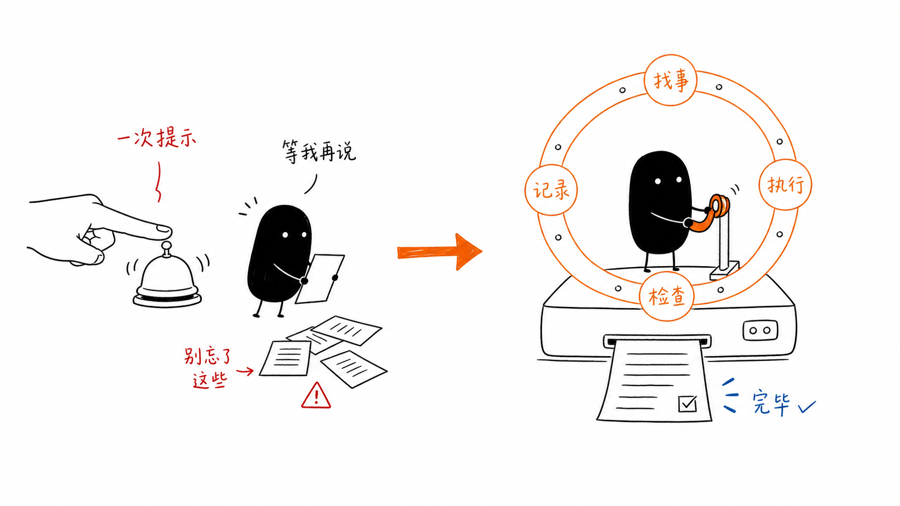
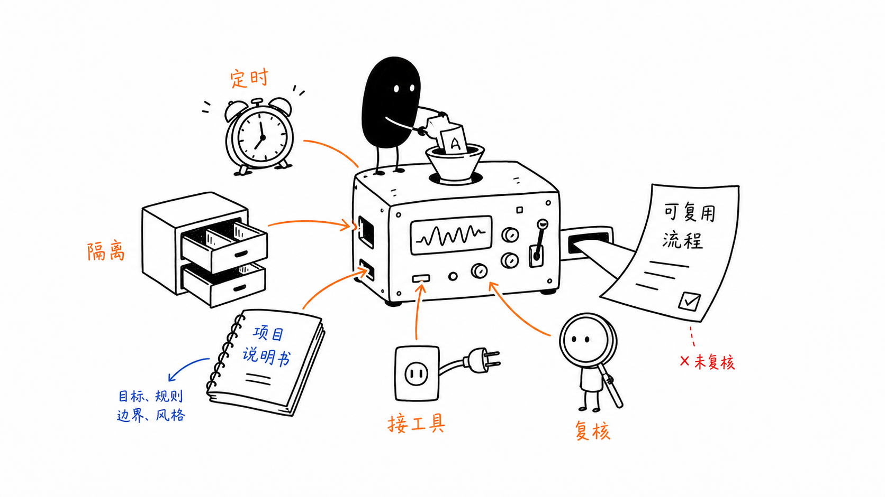
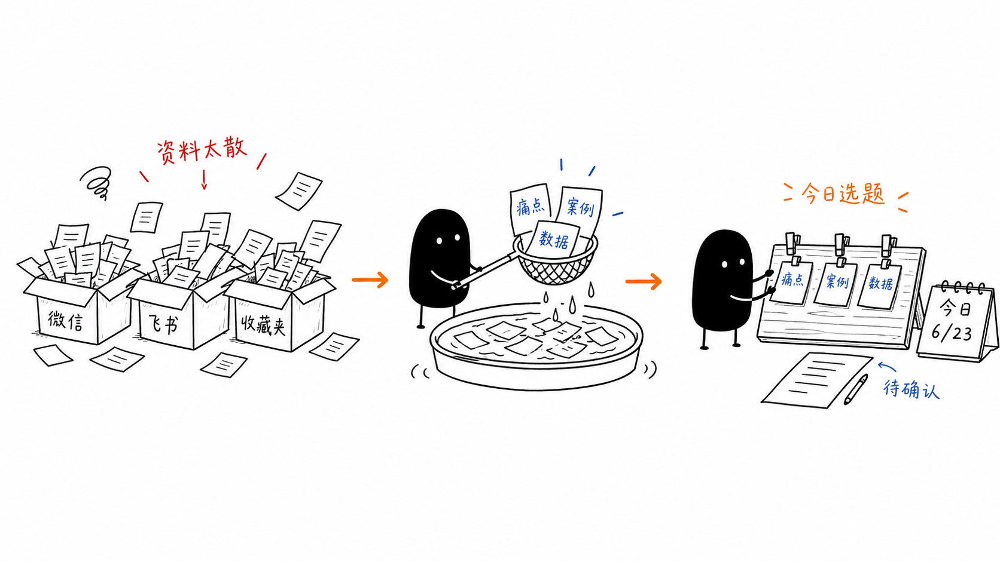
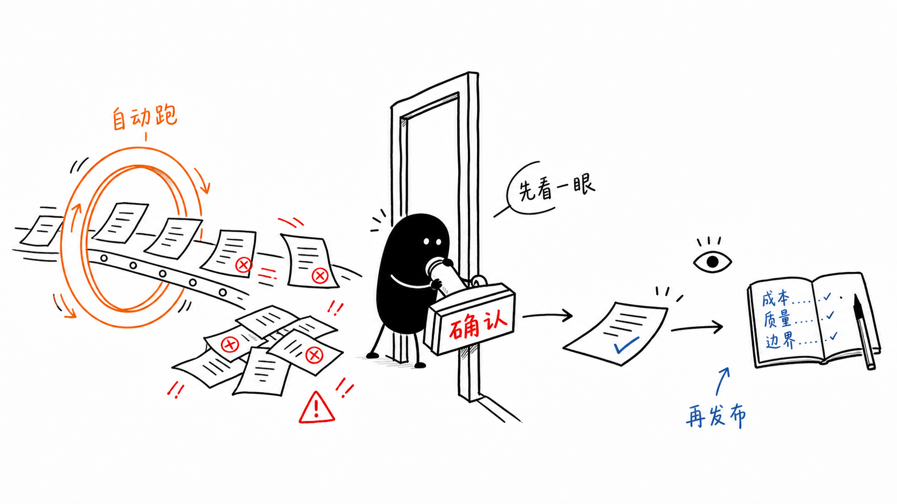

# 别只会写提示词了：AI 开始自己跑循环了

很多人现在用 AI，还是停留在一个动作：

我说一句，AI 做一步。

我再补一句，AI 再改一步。

这当然有用。

但 AI Agent 正在进入下一个阶段：

> **以后真正值钱的，可能不是你多会写提示词，而是你多会设计 AI 的工作循环。**

这就是最近很多人讨论的 **Loop engineering**。

直译叫“循环工程”。

不用被名字吓住。

你可以先这样理解：

> **以前是你不断提醒 AI 做事。  
> 以后是你设计一个规则，让 AI 到点自己找事、做事、检查、记录，再把关键结果交给你确认。**



## 先看结论

如果你只想先知道这件事值不值得关注，看这 5 句就够了：

1. **Loop engineering 不是更高级的提示词，而是更稳定的工作流。**
2. **AI 不再只是“被你问一下才动”，而是可以按规则反复运行。**
3. **对运营人来说，最适合先做的不是全自动发文，而是自动筛素材、整理选题、提醒复盘。**
4. **循环越自动，人越不能消失，因为确认、取舍、质量和边界还得你负责。**
5. **新手第一步，不是追求全自动，而是先做一个只读、可检查、可停止的小循环。**

这篇文章就讲清楚一件事：

> **普通人该怎么理解 AI 从“聊天工具”变成“循环工作助手”。**

## 一、以前拼提示词，现在拼的是循环

过去我们用 AI，很像在反复喊一个临时助手：

帮我总结一下。

帮我改一下标题。

帮我再列 10 个选题。

你不说，它就停。

所以你真正累的，不一定是写内容。

而是不断提醒、不断复制、不断切换、不断检查。

对运营人来说，这种碎活特别多：

微信群里有没有新的用户痛点？

飞书会议纪要里有没有能写成文章的点？

收藏夹里最近存的资料，哪些值得进入选题池？

公众号发布后，数据有没有异常？

这些事都不难。

但每天都要做，就很消耗人。

> **提示词解决的是“这一次怎么问”。  
> 循环解决的是“这件事以后能不能稳定重复”。**

这就是 Loop engineering 最核心的变化。

它不是让 AI 更会聊天。

而是让 AI 有一个可以重复执行的工作节奏。

## 二、一个 AI 循环，要有 5 个零件

分享里提到，一个循环大致需要五个东西。

不用记英文。

先记普通话版本：

| 技术说法 | 你可以理解成 | 作用 |
| --- | --- | --- |
| Automations | 闹钟 | 到点自动开始 |
| Worktrees | 隔离工位 | 多个任务互不打架 |
| Skills | 项目说明书 | 不用每次重新讲规则 |
| Plugins / Connectors | 工具接口 | 让 AI 接上真实资料和工具 |
| Sub-agents | 复核同事 | 做事的人和检查的人分开 |

还有一个很容易被忽略的东西：

**记事本。**

也就是 Memory。

因为 AI 单次对话很容易忘。

但文件、表格、看板、笔记不会忘。

所以一个长期运行的 AI 循环，必须有地方记录：

做过什么。

发现什么。

下次继续什么。

> **能长期工作的 AI，不靠记性，靠记录。**

这个记录可以放在 Obsidian。

也可以放在飞书表格、Notion、GitHub Issue。

工具不重要。

重要的是：**循环不能只活在一次聊天里。**



## 三、这对运营人有什么用？

如果你不是程序员，看到 Worktree、MCP、Sub-agent，可能会觉得离自己很远。

其实不用一开始想那么复杂。

对运营人和内容人来说，第一个 AI 循环可以非常朴素：

> **每天帮我从资料堆里捞出 3 个值得看的选题。**

比如你可以设计一个“每日选题筛选 loop”：

每天上午 9 点，AI 自动检查昨天新增的素材。

它从微信群记录、飞书会议纪要、收藏夹摘录、Obsidian 素材库里，筛出 3 个可能值得写的选题。

每个选题只输出四件事：

| 输出项 | 你要看的重点 |
| --- | --- |
| 读者痛点 | 这是不是读者真的关心的问题 |
| 写作角度 | 这篇文章从哪里切进去 |
| 可用素材 | 有没有真实材料支撑 |
| 待确认问题 | 哪些地方必须你判断 |

然后 AI 把结果写进一个“待确认选题”文件。

你打开以后，只需要判断：

这个能不能写？

值不值得写？

要不要继续深挖？

> **AI 先帮你捞一遍，人再决定要不要下锅。**

这就很适合普通用户。

它没有替你做最终判断。

但它把最烦的“找资料、筛线索、整理成选题”先做了一遍。



## 四、真正变化的是你的角色

以前你主要是“提示 AI 的人”。

你要想清楚怎么问。

你要不断补充上下文。

你要盯着它每一步输出。

但当 AI 循环开始出现，你的角色会变成：

**设计工作方式的人。**

你要想的不是一句提示词怎么写得更漂亮。

而是这些问题：

| 你要设计的事 | 关键问题 |
| --- | --- |
| 任务范围 | 这件事适不适合自动跑 |
| 运行节奏 | 多久跑一次合适 |
| 资料权限 | 它能读什么，不能读什么 |
| 输出结果 | 什么可以自动记录 |
| 人工确认 | 什么必须等我看过 |
| 停止条件 | 什么情况不要继续消耗成本 |

> **提示词时代，你在教 AI 回答。  
> 循环时代，你在教 AI 工作。**

这是一个很大的变化。

因为你不再只是追求“这一轮回答好不好”。

你开始关心：

这套流程能不能重复？

能不能检查？

能不能停止？

能不能交给未来的自己继续用？

## 五、越自动，越要守住边界

Loop engineering 听起来很先进。

但它不是魔法。

它会消耗 token。

它可能误判优先级。

它可能整理出看起来完整、但其实很空的内容。

它也可能因为权限太大，读到或改到不该动的资料。

所以新手不要一上来就做这些高风险循环：

自动发布文章。

自动覆盖文档。

自动删除文件。

自动修改重要资料库。

更稳妥的顺序是：

| 阶段 | 适合做什么 | 风险 |
| --- | --- | --- |
| 第一步 | 读取资料、筛选线索、生成清单 | 低 |
| 第二步 | 追加记录、更新待办、写入草稿 | 中 |
| 第三步 | 覆盖、删除、发布、改权限 | 高 |

> **只读，可以大胆一点。  
> 写入，要慢一点。  
> 删除和发布，必须非常谨慎。**

AI 可以帮你跑循环。

但最后的确认权，不能一起交出去。



## 六、新手可以直接这样开始

你不需要一开始搭复杂系统。

先设计一个最小循环就够了。

比如：

**每日选题筛选 loop。**

你可以这样对 Codex 或类似 AI Agent 说：

```text
请帮我设计一个每日选题筛选 loop。

目标：
每天从我指定的素材文件夹里，筛出 3 个适合公众号的选题。

规则：
1. 只读取资料，不要删除、移动、覆盖任何文件。
2. 每个选题输出：读者痛点、切入角度、可用素材、需要我确认的问题。
3. 把结果写入“待确认选题.md”。
4. 如果没有高价值选题，就明确写“今日无合适选题”，不要硬凑。
5. 每次执行后记录日期和已处理的资料范围，避免重复处理。
```

这段话的重点，不是它像不像高级提示词。

而是它已经有了循环意识：

有目标。

有范围。

有边界。

有输出。

有停止条件。

有记录方式。

> **会问 AI，只能解决一次问题。  
> 会设计循环，才是在搭自己的 AI 工作系统。**

## 最后说一句

未来用 AI，可能会越来越少比拼谁更会写一句提示词。

而是比拼谁更会把自己的重复工作，设计成可检查、可复用、可停止的循环。

但这不代表人不重要了。

恰恰相反。

循环越自动，人越要清楚自己在设计什么。

哪些事可以交给 AI 跑。

哪些结果必须自己看。

哪些资料不能随便开放。

哪些成本不能无限消耗。

> **好的 AI 循环，不是让你放弃思考。  
> 而是把重复检查、重复整理、重复搬运这些碎活拿走，让你把精力留给判断。**

你不是要成为一个更会催 AI 干活的人。

你要慢慢成为一个能给 AI 设计工作规则的人。

我是 **黎子**，专注 **AI+运营** 提效。每天进步一点点，让 AI 为你打工。关注我，争取早日退休。

---

参考：

- 用户提供的分享原文：关于 Loop engineering、Automations、Worktrees、Skills、Connectors、Sub-agents、Memory 的工作方式总结。
- OpenAI Codex Manual：[Automations](https://developers.openai.com/codex/app/automations)、[Worktrees](https://developers.openai.com/codex/app/worktrees)、[Agent Skills](https://developers.openai.com/codex/skills)、[Model Context Protocol](https://developers.openai.com/codex/mcp)、[Subagents](https://developers.openai.com/codex/subagents)、[Memories](https://developers.openai.com/codex/memories)。
