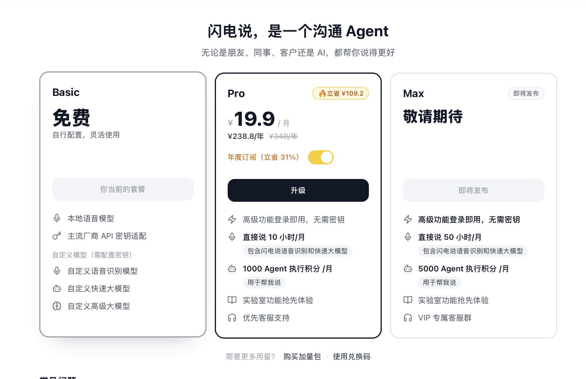
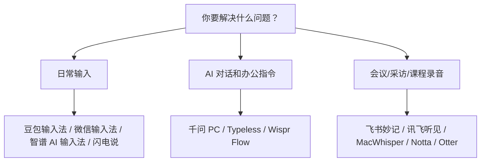

# AI 语音输入工具怎么选？我把价格、免费额度和真实优缺点整理了一遍

> 当 AI 对话和内容创作越来越频繁，语音输入会变成新的效率入口。

现在很多人开始用语音输入，不是因为懒得打字。

而是因为和 AI 对话、写公众号、做会议纪要时，打字真的开始慢了。

但语音输入工具不能乱选。

有些适合中文聊天。

有些适合英文邮件。

有些适合会议录音。

有些主打本地运行和隐私。

如果只看“识别准确率”，很容易选错。

我重新查了一遍官方价格、免费额度和网络评价，按普通办公和自媒体写作场景，整理成这篇选型版。

> 注：价格和免费额度以 2026 年 6 月 14 日公开页面为准，后续可能调整，购买前以官网为准。

## 先给结论

如果你主要是中文办公、写公众号、和 AI 高频对话，优先试：

**豆包输入法、智谱 AI 输入法、千问 PC 语音输入、闪电说。**

如果你主要写英文邮件、跨语言沟通，优先试：

**Typeless 或 Wispr Flow。**

如果你要处理会议、采访、课程录音，优先试：

**飞书妙记、讯飞听见、MacWhisper。**

如果你最在意隐私和本地处理，优先试：

**闪电说、MacWhisper。**

## 一张表先看懂

> 先分清使用场景，再比较价格和功能，选择会简单很多。

| 工具 | 适合谁 | 免费能做什么 | 付费买到什么 | 我对它的判断 |
| --- | --- | --- | --- | --- |
| 豆包输入法 | 手机中文输入、方言、聊天、灵感记录 | App 免费；语音、键盘、方言、中英混输等核心能力可用 | 目前没查到独立订阅价格 | 中文和方言很强，适合普通人先试 |
| 微信输入法 | 微信生态、日常聊天、轻量办公 | App 免费；语音输入、问 AI、常用语、剪贴板等 | 目前没查到独立订阅价格 | 稳、轻、低门槛，但不是最强创作工具 |
| 智谱 AI 输入法 | 电脑端中文语音输入、写稿、AI 对话 | 官方 FAQ 写明 AI 语音输入全面免费 | 暂无独立语音输入订阅 | 免费且电脑端好用，适合先试 |
| 千问 PC 语音输入 | 想在任何应用里“说话+让 AI 干活” | 官方报道显示目前全面开放免费使用 | 暂无独立语音输入订阅 | 更像 AI 助手入口，不只是输入法 |
| 闪电说 | 电脑端输入、隐私敏感、本地模型偏好 | Basic 免费，支持本地语音模型和 API 密钥适配 | Pro 年付折算 ¥19.9/月，月付 ¥29/月；含直接说 10 小时/月、1000 Agent 积分/月 | 速度和隐私是亮点，Pro 适合不想折腾密钥的人 |
| Typeless | 英文、多语言、邮件、跨应用写作 | 免费 8000 words/week，标准准确率 | Pro 年付 $12/月，月付 $30/月；无限字数、增强准确率、优先访问 | 英文和表达整理强，但中文用户要考虑价格 |
| Wispr Flow | 英文语音输入、海外办公 | 桌面 2000 words/week，iPhone 1000 words/week | Pro 年付 $12/月，月付约 $15/月；无限输入等 | 英文口碑好，中文口碑分化 |
| 飞书妙记 | 飞书会议、团队协作、会议纪要 | 飞书基础免费版曾给到 300 分钟/用户/月妙记转写时长 | 商业版/企业版妙记转写不限；AI 会员另有智能纪要额度 | 在飞书生态里非常顺，不在飞书里就没那么必要 |
| 讯飞听见 | 采访、课程、长录音、专业转写 | 录音和实时浏览免费，分享/下载转写内容收费 | 机器快转约 0.33 元/分钟；App 内有 10 分钟 3 元、30 分钟 8 元、1 小时 18 元等时长卡 | 专业转写成熟，但长期用要算成本 |
| MacWhisper | Mac 用户、本地转写、隐私敏感音频 | 免费版可用较小模型做本地转写 | 官网直购为一次性许可证；近期评测多写约 59 欧元，最终以结账页为准 | 适合长音频和隐私场景，不适合随处输入 |
| Notta / Otter | 国际会议、英文会议、跨平台转写 | Notta 免费 120 分钟/月但单次 3 分钟；Otter 免费 300 分钟/月 | Notta Pro 年付 $8.17/月；Otter Pro 年付约 $8.33/月 | 更适合英文会议，不是中文写作首选 |

## 1. 豆包输入法：中文、方言、手机端，最值得普通人先试

豆包输入法的优势很明确：中文语音输入强，方言支持好，轻声说话和中英混输也做得比较顺。

App Store 评价里，很多用户夸它方言口音也能识别得准、速度快、能根据语义改写修正字词。雷科技的横评也认为豆包输入法在语音输入稳定性、长文本、中英混说和方言支持上表现突出。

它的问题也很明确：它更像一个输入法，不是完整的 AI 写作工具。

也就是说，它适合把你说的话变成文字，但如果你要深度改稿、生成文章结构，还是要交给豆包 App、ChatGPT、千问、DeepSeek 这类 AI 助手继续处理。

价格：

- 免费：目前核心输入能力可免费使用。
- 付费：未查到独立语音输入订阅价格。

适合：

- 手机上发消息、记灵感。
- 方言用户。
- 中文自媒体作者在路上快速记录想法。

不适合：

- 需要专业会议转写、说话人区分、导出纪要的人。
- 非常在意输入法联网和权限的人。

一句话建议：

**如果你不知道先装哪个，中文用户可以先试豆包输入法。**

## 2. 微信输入法：不折腾的人，用它最省心

微信输入法不是最“AI 感”的工具，但它胜在稳、轻、离日常近。

App Store 信息显示，微信输入法免费，支持语音输入、中文英文和多种方言，也支持不限时长语音输入、问 AI、常用语、剪贴板等功能。

它适合普通用户每天聊天、写短句、发朋友圈、在微信生态里快速输入。

它的问题是：它不是为长文创作设计的。

如果你要写一篇公众号，它能帮你把口述内容输入进去，但它不会像 Typeless、千问这类工具一样，把你的表达自动整理得很漂亮。

价格：

- 免费：语音输入、常用输入工具、问 AI 等能力可用。
- 付费：未查到独立订阅价格。

适合：

- 微信聊天。
- 普通手机输入。
- 不想折腾新工具的人。

不适合：

- 想把语音输入作为主力写作工具的人。
- 想要强 AI 润色、风格改写、结构化输出的人。

一句话建议：

**它不是最强，但可能是最容易坚持用下去的。**

## 3. 智谱 AI 输入法：电脑端免费语音输入，值得试

智谱 AI 输入法适合电脑端用户。

官方 FAQ 明确写了：AI 语音输入功能已全面免费开放，所有用户无需额外付费。

它的定位是通过快捷键，把语音实时转换成高质量文字，可以在微信、飞书、Word、代码编辑器等输入框里使用。

网络评价里，大家比较认可它的准确率、中英混合和专业术语识别。智谱相关资料也提到 GLM-ASR 端侧模型，本地运行能带来更低延迟和更好的隐私保护。

它的问题是：产品还在快速迭代期，稳定性、快捷键习惯、不同软件兼容性都需要自己试。

价格：

- 免费：官方 FAQ 显示 AI 语音输入全面免费。
- 付费：未查到独立语音输入订阅。

适合：

- Mac / Windows 上写稿、写文档、问 AI。
- 想先免费体验 AI 语音输入的人。
- 中文办公和技术术语较多的人。

不适合：

- 只在手机上输入的人。
- 完全不想登录或使用云端服务的人。

一句话建议：

**电脑端中文语音输入，智谱是很值得先试的免费选项。**

## 4. 千问 PC 语音输入：更像“语音调用 AI”，不是单纯输入法

千问 PC 端新上线的语音输入，不只是把声音转成文字。

根据公开报道，它支持在各类桌面应用中用快捷键唤起，可以去语气词、纠错、格式化整理，还能直接下达创作、问答、翻译等指令。

这点和普通输入法不一样。

普通输入法解决的是：我说一句，它打一句。

千问更像是：我说一个任务，它帮我整理、回复、解释、翻译，甚至直接调 AI 处理。

价格：

- 免费：公开报道显示目前千问 PC 语音输入功能全面开放免费使用。
- 付费：未查到独立语音输入订阅。

适合：

- 经常让 AI 改写、总结、回复消息的人。
- 想在 Word、浏览器、微信、邮件里直接用 AI 的人。
- 不满足于“转文字”，还想“让 AI 接着干活”的人。

不适合：

- 只想要一个简单输入法的人。
- 对工具稳定性要求很高、暂时不想尝鲜的人。

一句话建议：

**如果你每天都在和 AI 对话，千问 PC 语音输入值得重点试。**

## 5. 闪电说：本地优先、隐私友好，适合电脑端重度输入

> 如果经常输入客户资料、内部文档或未发布选题，本地处理和隐私边界就很重要。

> 闪电说官网价格页显示：Basic 免费；Pro 年付折算 ¥19.9/月，月付 ¥29/月；Max 暂未发布。

闪电说最值得注意的点，不是“它也能语音转文字”。

而是它强调端侧优先、本地模型运行。

阮一峰周刊 GitHub 自荐帖里提到，闪电说的语音识别模型优先在本地执行，不依赖网络，音频不用上传云端。36 氪文章也提到，它走本地小模型路线，反馈非常快，而且完全免费。

这对隐私敏感用户很关键。

比如你经常写客户资料、内部文档、未发布选题，输入法是否把音频和文本上传云端，就不只是体验问题，而是边界问题。

但本地模型也有代价。

网络评测里也有人提到，闪电说速度很爽，但在中英文混排、专有名词、说话节奏较快时，准确率可能不如更大的云端模型。

价格：

- 免费：Basic 免费，支持本地语音模型、主流厂商 API 密钥适配、自定义语音识别模型、自定义快速大模型和高级大模型。
- 付费：Pro 年付折算 ¥19.9/月，¥238.8/年；月付 ¥29/月；含直接说 10 小时/月、1000 Agent 执行积分/月、实验室功能抢先体验和优先客服。
- 加量包：官网价格页显示“直接说 10 小时”¥20，“Agent 执行 1000 积分”¥20。

适合：

- 电脑端重度输入。
- 隐私敏感。
- 希望尽量本地处理音频。
- 写作、AI 对话、聊天回复。

不适合：

- 对专有名词、中英文混输准确率要求极高的人。
- 不想折腾本地模型或 API Key 的人。

一句话建议：

**如果你在意隐私，闪电说比很多云端语音输入法更值得看。**

## 6. Typeless：英文和多语言很强，但价格不便宜

Typeless 的强项不是“便宜”。

它的强项是把语音变成更像人写过的文字。

官方价格页显示，免费版每周 8000 words，标准准确率；Pro 年付 $12/月，月付 $30/月，解锁无限字数、增强准确率、高峰期优先访问等。

它的官网也强调 100+ 语言、不同 App 自动适配语气、边说边翻译、个人词典、选中文本后用语音改写等能力。

网络评价里，大家普遍夸它英文、邮件、多语言、结构化表达能力。36 氪/极客公园体验文章认为，Typeless 的价值不只是快，而是降低返工成本，能理解说话人想表达什么。

但对中文用户来说，它有两个现实问题。

第一，价格高。

月付 $30，折合人民币大概两百多一个月。

第二，它更适合英文和多语言办公。

如果你主要写中文公众号，免费豆包、智谱、千问已经能解决很多问题，不一定非要上 Typeless。

价格：

- 免费：8000 words/week，标准准确率，标准高峰访问。
- 付费：Pro 年付 $12/月，月付 $30/月；无限字数、增强准确率、优先访问、团队管理等。

适合：

- 英文邮件。
- 海外客户沟通。
- 中英混合、多语言翻译。
- 希望口语自动整理成正式文字的人。

不适合：

- 只写中文、预算敏感的人。
- 对云端处理非常介意的人。

一句话建议：

**Typeless 很好，但更适合愿意为英文/多语言表达质量付费的人。**

## 7. Wispr Flow：海外口碑强，中文用户要谨慎

Wispr Flow 是海外很火的 AI 语音键盘。

官方价格页显示，免费版桌面端每周 2000 words，iPhone 每周 1000 words；Pro 年付 $12/月，月付约 $15/月，解锁更高额度和更多功能。

它适合英语用户在 Slack、Gmail、Docs、ChatGPT 等地方随处语音输入。

但中文用户要谨慎。

Google Play 上有用户评价提到，Wispr Flow 中文识别和表达还原不够稳定，和免费的豆包输入法相比，中文体验优势不明显。

价格：

- 免费：Mac / Windows 每周 2000 words，iPhone 每周 1000 words。
- 付费：Pro 年付 $12/月，月付约 $15/月。

适合：

- 英文办公。
- 海外团队沟通。
- 已经在用英文工作流的人。

不适合：

- 中文为主。
- 预算敏感。
- 希望本地离线处理的人。

一句话建议：

**英文场景可以试，中文场景不要先付费。**

## 8. 飞书妙记：团队会议好用，个人写作不是第一选择

> 会议和采访不是“输入法”场景，更适合用能分段、区分说话人、生成摘要的转写工具。

飞书妙记适合会议。

它的优势不是单纯转写，而是和飞书会议、文档、任务、团队协作打通。

飞书官方公告曾写到：基础免费版妙记语音转文字时长为 300 分钟/用户/月，商业版/企业版不限。

飞书官方内容也强调，妙记适合会议转写、智能纪要、待办提取和知识沉淀。

但如果你只是个人写公众号，它不是最顺手的输入工具。

它更适合把“开过的会”变成“可搜索、可分发、可追踪的内容”。

价格：

- 免费：基础免费版曾给 300 分钟/用户/月妙记转写时长。
- 付费：商业版/企业版妙记转写不限；AI 会员/智能纪要有额外额度规则。

适合：

- 团队会议。
- 飞书重度用户。
- 会后自动生成纪要和待办。

不适合：

- 单纯写文章。
- 不在飞书生态办公的人。

一句话建议：

**你已经用飞书，它就是会议纪要首选；不用飞书，就不用为了妙记专门迁移。**

## 9. 讯飞听见：专业转写成熟，但要按分钟算账

讯飞听见更像专业录音转写工具。

它适合会议、采访、课程、演讲、媒体素材整理。

官方 FAQ 里写得很清楚：录音免费，录音过程中实时转文字和翻译的浏览免费；但如果要分享或下载转文字内容，需要收费。

收费上，讯飞听见帮助页显示中文/英文机器快转约 0.33 元/分钟。App Store 内购里也能看到 10 分钟 3 元、30 分钟 8 元、1 小时 18 元、3 小时 50 元、录音转写包连续包月 18 元、畅享包连续包月 88 元等选项。

它的优点是成熟。

长音频、采访、课程、字幕、角色区分、AI 总结、人工精转，这些能力比普通输入法强很多。

它的问题是贵不贵要看你用量。

偶尔转一次采访不贵。

但如果每周都有大量录音，要认真算账。

价格：

- 免费：录音和实时浏览免费。
- 付费：下载/分享转写内容收费；机器快转约 0.33 元/分钟；App 内有时长卡和会员包。

适合：

- 采访录音。
- 课程整理。
- 长会议转写。
- 需要导出 Word、字幕、精转的人。

不适合：

- 日常聊天输入。
- 和 AI 对话时即时输入。
- 不想按分钟付费的人。

一句话建议：

**它不是输入法，是录音转写工具；用在采访和会议上才值。**

## 10. MacWhisper：Mac 本地转写，隐私党和长音频用户适合

MacWhisper 的逻辑和前面都不一样。

它不是让你在任何输入框里说话。

它是把音频文件转成文字。

它基于 Whisper / Parakeet 等模型，可以在本地 Mac 上处理音频。很多评价都把它的价值放在两个点上：本地处理、一次性买断。

官方帮助文档显示，官网直购版本提供一次性终身许可证。多个近期评测提到 MacWhisper Pro 价格约 59 欧元，但我这次核验时，官方公开页面没有稳定显示具体价格，所以最终价格建议以官网结账页为准。

App Store 版本叫 Whisper Transcription，价格体系可能是月付、年付或买断，和官网版本不完全一样。

免费版通常可以用小模型。

Pro 版解锁更大模型和更多高级功能，准确率、速度、批量处理体验会更好。

价格：

- 免费：可用基础本地转写能力，小模型为主。
- 付费：官网直购为一次性许可证；近期评测多写约 59 欧元，最终以结账页为准；App Store 版本有订阅/买断方案，价格以商店为准。

适合：

- Mac 用户。
- 播客、访谈、课程录音。
- 不想把音频上传云端的人。
- 经常处理长音频的人。

不适合：

- Windows 用户。
- 想在微信、Obsidian、AI 对话框里随处语音输入的人。
- 不想研究模型和导入导出流程的人。

一句话建议：

**如果你有 Mac，又经常处理敏感录音，MacWhisper 很值得。**

## 怎么选，最简单的判断方式

如果你是普通中文用户：

先试 **豆包输入法 + 智谱 AI 输入法**。

一个解决手机输入，一个解决电脑输入。

如果你是 AI 重度用户：

试 **千问 PC 语音输入**。

它不只是输入，还能把语音变成 AI 指令。

如果你最在意隐私：

试 **闪电说 + MacWhisper**。

一个偏电脑端实时输入，一个偏本地长音频转写。

如果你做英文办公：

试 **Typeless**，预算低再试 **Wispr Flow** 免费版。

如果你做采访和会议：

个人轻量先试 **飞书妙记**。

专业转写、导出、人工精转，再看 **讯飞听见**。

## 我的最终建议

不要追求一个工具解决所有问题。

语音输入至少分三类：

如果只是聊天和日常办公，没必要一上来买 Typeless。

如果只是偶尔转一次会议，也没必要折腾本地模型。

如果你每天都写稿、问 AI、整理访谈，那语音输入就不是小工具了。

它会变成你的新键盘。

真正要选的不是“哪个识别率最高”。

而是：

你的声音，最后要去哪里。

是进入聊天框。

进入 AI 对话框。

还是进入一份会议纪要。

这个问题想清楚了，工具就很好选。

我是 **黎子**，专注 **AI+运营** 提效。每天进步一点点，让 AI 为你打工。关注我，争取早日退休。
