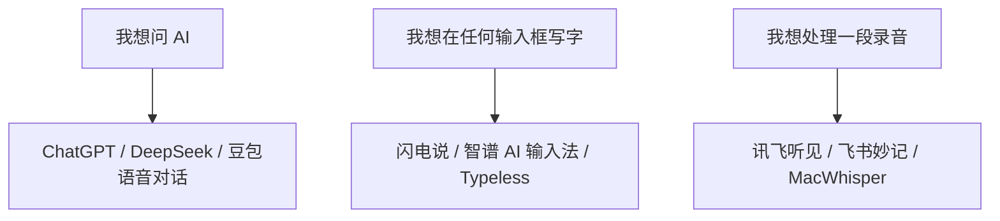

# 语音输入真的比打字快吗？我把常用工具分成了这几类

很多人开始认真用语音输入，并不是因为突然不想打字。

而是因为 AI。

当你每天都要和 AI 对话、写公众号、改文案、整理会议内容时，键盘会变成一个很明显的瓶颈。

脑子里的话已经出来了。

手还在一个字一个字敲。

这时候你会发现，语音输入不是一个“偷懒工具”，它更像是 AI 时代的新入口。

但问题也来了。

现在语音转文字的软件太多了。

有传统输入法里的语音按钮，有专门的 AI 语音输入法，有会议转写工具，还有豆包、DeepSeek、ChatGPT 这类 AI 对话工具自带的语音能力。

它们看起来都叫“语音输入”，但其实解决的不是同一件事。

如果选错了，你会觉得它鸡肋。

如果选对了，它真的能把日常办公和内容创作的效率往上拉一截。

> 配图 1｜首图建议  
> 桌面上同时打开 Obsidian、AI 对话窗口和一个麦克风小浮窗。画面重点不是“工具很多”，而是“说话正在变成文字”。  
> 可用关键词：语音输入、AI 对话、Obsidian 写作、麦克风、文字流。

## 先说结论：不要只问哪个最强，要先问你要拿它干什么

如果你只是偶尔发微信，手机输入法自带语音就够了。

如果你想在电脑上写公众号、写文档、和 AI 高频对话，应该优先看「AI 语音输入法」。

如果你要处理会议、采访、课程录音，那就不要拿输入法硬扛，应该用「录音转写工具」。

如果你特别在意隐私，或者经常转写长音频，可以考虑本地转写类工具。

下面这张表，可以先帮你快速定位。

| 工具 | 更适合什么场景 | 优点 | 缺点 |
| --- | --- | --- | --- |
| 闪电说 | 电脑端日常输入、AI 对话、聊天回复 | 端侧优先、快捷键唤起、强调上下文和“帮我说” | 新工具，生态和稳定性还需要长期观察 |
| 智谱 AI 输入法 | 电脑端语音写作、办公文档、AI 对话 | 免费开放、支持 macOS/Windows、自动整理成更可用的文字 | 需要登录和适应快捷键，部分体验依赖网络和模型服务 |
| Typeless | 多语言办公、英文邮件、跨应用语音写作 | 语音转成“像人写过”的文字，跨应用体验强 | 海外产品，价格、网络和中文本地化体验要实测 |
| 豆包输入法 | 手机端语音输入、方言、聊天和短文本 | 方言识别、智能纠错、轻声输入体验突出 | 更偏输入法，不是完整的会议转写或长文整理工具 |
| 微信输入法 / 微信 PC 语音输入 | 微信生态、日常聊天、轻量语音输入 | 上手低、无学习成本、适合高频聊天 | 专业写作、长文本结构化能力有限 |
| 讯飞听见 | 会议、采访、课程、长音频转文字 | 实时转写、角色区分、摘要、翻译、格式导出成熟 | 更像会议工具，不适合替代日常输入法 |
| 飞书妙记 | 飞书会议、团队协作、会议纪要 | 和飞书生态结合好，适合组织内部沉淀 | 离开飞书生态后优势会下降 |
| MacWhisper / Whisper Transcription | Mac 用户、本地转写、长音频处理 | 可基于 Whisper 转写，适合隐私和长音频 | 不是“随处输入”的输入法，需要先录音或导入文件 |
| Apple 听写 / Windows 语音键入 | 系统级临时输入 | 免费、自带、打开就能用 | 智能润色和上下文改写能力较弱 |
| DeepSeek / ChatGPT / 豆包语音对话 | 和 AI 直接聊天 | 适合提问、头脑风暴、口头推演 | 它们不是通用输入法，不能直接替代所有输入框 |

## 第一类：真正适合“日常办公”的，是 AI 语音输入法

这里要把概念分清楚。

传统语音输入的目标是：你说什么，它尽量打出什么。

AI 语音输入的目标是：你说得有点乱，它帮你变成一段能用的文字。

这个区别很关键。

因为我们平时说话，本来就不是按照书面语说的。

比如你想写一句公众号开头，口头说出来可能是：

“就是现在很多人不是因为喜欢打字才用语音输入，而是因为跟 AI 对话的时候打字太慢了。”

传统输入法可能把它原样转出来。

但 AI 语音输入法更理想的结果是：

“很多人开始使用语音输入，并不是因为不想打字，而是因为和 AI 高频对话时，键盘开始变慢了。”

这中间差的不是识别率。

而是“把口语变成可发布文字”的能力。

### 1. 闪电说：更像一个电脑上的“沟通 Agent”

你口述里说的“反念说”，我理解大概率是「闪电说」。

它的定位不是传统输入法，而是一个更懂上下文的 AI 语音输入工具。

官方介绍里，它有两个很有意思的动作：短按直接说，长按帮我说。

这其实把两种需求分开了。

一种是我已经想清楚了，只需要快速输入。

另一种是我大概知道意思，但不知道怎么表达得更清楚、更自然、更得体。

对自媒体作者来说，后者很有价值。

因为很多时候，我们不是没有想法，而是想法还没有整理成句子。

优点：

- 适合电脑端高频输入，尤其是 AI 对话、聊天回复、文档创作。
- 强调端侧优先和低延迟，对隐私敏感的人会更有吸引力。
- “帮我说”适合把口语变成更得体的文字。
- 如果未来上下文记忆做得好，会比普通输入法更像一个写作助理。

缺点：

- 仍然是相对新的工具，长期稳定性、兼容性和收费策略需要继续观察。
- 如果你只是手机上发几句话，它可能有点重。
- 过度依赖“帮我说”，也可能让文字变得不够像自己。

适合人群：

经常在电脑上写东西、回复消息、和 AI 对话的人。

不适合人群：

只想偶尔在手机上发语音文字的人。

> 配图 2｜建议截图  
> 截闪电说官网首屏，重点标出“短按直接说 / 长按帮我说”。旁边配一段口语输入变成书面表达的前后对比。

### 2. 智谱 AI 输入法：适合先拿来试水的免费型选手

智谱 AI 输入法的好处是，它把门槛降得比较低。

官方页面写得很直接：你说，我写。

它支持 macOS 和 Windows，也强调可以在微信、飞书、Word、代码编辑器等输入框里使用。

这类工具最适合做一件事：

把你原来需要打字的地方，尽量都换成语音。

比如你在 Obsidian 里记录选题。

比如你在 AI 对话框里连续追问。

比如你在 Word 里先说出一段文章粗稿。

它的意义不是替你思考，而是减少“想法到文字”中间的摩擦。

优点：

- 官方 FAQ 显示 AI 语音输入功能已免费开放。
- 支持 macOS 和 Windows，覆盖普通办公人群。
- 更适合日常输入框，不局限在某一个软件里。
- 对写公众号初稿、AI 提问、工作消息都比较友好。

缺点：

- 需要适应快捷键和后台常驻。
- 识别效果会受到麦克风、环境噪音、网络状态影响。
- 自动润色有时会把你的口语风格磨平，需要发布前再人工修。

适合人群：

想先低成本体验“说话即成文”的办公用户。

不适合人群：

对本地隐私要求很高，或者完全不想让语音经过云端服务的人。

> 配图 3｜建议截图  
> 截智谱 AI 输入法官网“你说，我写”页面，再放一张自己在 Obsidian 里语音输入的实测截图。

### 3. Typeless：更偏“把语音变成写得像样的文字”

Typeless 的定位比较清楚：AI voice dictation。

它不是只把语音转成文字，而是强调根据不同应用调整语气和风格。

比如你在邮件里说一句话，它希望输出的是像邮件的文字。

你在聊天软件里说一句话，它希望输出的是像聊天的文字。

这个方向很对。

因为语音输入最大的问题，并不是听不懂。

而是听懂以后，写出来还像一段口水话。

Typeless 更适合英文办公、多语言沟通、跨应用写作。

如果你经常写英文邮件、和海外团队协作，或者需要边说边翻译，它会比普通输入法更有优势。

优点：

- 跨应用语音输入体验强。
- 适合英文邮件、多语言表达、翻译型输入。
- 能把口语整理成更自然的书面表达。

缺点：

- 海外产品，中文语境、网络稳定性和付费策略需要自己实测。
- 如果主要是中文自媒体写作，它未必比国内工具更顺手。
- 对普通用户来说，可能需要一点适应成本。

适合人群：

中英混合办公、跨境业务、英文邮件和多语言沟通人群。

不适合人群：

只做中文微信聊天和公众号初稿的人。

> 配图 4｜建议截图  
> 截 Typeless 的下载页或产品页，重点展示“macOS / Windows / mobile”和“不同应用不同语气”的信息。

## 第二类：手机端和聊天场景，豆包输入法、微信输入法更顺手

如果你的主要场景是手机聊天、发朋友圈、记灵感、在路上和 AI 对话，那就不用一上来追求最复杂的工具。

这时候更重要的是三个字：

顺手。

### 4. 豆包输入法：方言和短文本很值得关注

你口述里的“多发的语音”，我理解大概率是「豆包输入法」或「豆包语音」。

豆包输入法的优势，是它不只是“识别普通话”，而是把方言、轻声输入、中英混合、智能纠错都放在了重点位置。

这对很多人很重要。

因为语音输入真正进入日常，不可能要求每个人都像播音员一样讲话。

你可能在地铁上轻声说。

可能带一点口音。

可能一句话里夹几个英文词。

如果一个输入法只能在安静环境下识别标准普通话，那它就很难成为日常工具。

优点：

- 适合手机端高频语音输入。
- 方言识别和语义纠错是明显卖点。
- 适合聊天、灵感记录、短文本创作。
- 和豆包 AI 生态结合，适合边输入边让 AI 继续处理。

缺点：

- 更像输入法，不是专业会议转写工具。
- 长文结构化能力有限。
- 如果你主要在电脑上写公众号，手机输入法只能解决一部分问题。

适合人群：

手机重度用户、方言用户、经常用豆包的人。

不适合人群：

需要处理一小时会议录音、采访录音的人。

> 配图 5｜建议截图  
> 手机上用豆包输入法语音输入一段带口语的文字，再截“识别前后修改”的效果。

### 5. 微信输入法 / 微信 PC 语音输入：胜在轻量和低门槛

微信输入法最大的优势，不一定是功能最多。

而是它离普通人的日常最近。

很多人本来就在微信里沟通，语音输入天然就有使用场景。

如果你只是想把一句话快速变成文字，微信输入法或者微信 PC 端的语音输入就已经够用。

尤其是一些不愿意折腾工具的人，先从它开始最现实。

优点：

- 上手成本低，适合日常聊天。
- 不需要为了一个小需求再装复杂工具。
- 适合短句、轻量输入、手机和微信生态。

缺点：

- 不适合长文写作和深度整理。
- 自动改写、风格适配能力有限。
- 如果你要在多个电脑软件中高频输入，体验不一定稳定。

适合人群：

主要在微信里聊天、发短文本的人。

不适合人群：

把语音输入当成主力写作工具的人。

> 配图 6｜建议截图  
> 微信聊天框里语音转文字的界面，配一张“短句输入够用，长文写作不够”的对比图。

## 第三类：会议、采访、课程录音，要用转写工具，不要用输入法硬撑

这里要提醒一下。

语音输入法和录音转写工具，不是一类东西。

输入法解决的是：我现在说一句话，它马上进输入框。

录音转写解决的是：我有一段音频，它要变成可整理、可搜索、可导出的文字材料。

如果你要做采访、自媒体选题、会议纪要、课程整理，重点就不是“打字快不快”。

而是：

能不能区分说话人。

能不能自动分段。

能不能做摘要。

能不能导出。

能不能回听校对。

### 6. 讯飞听见：成熟的录音转写和会议整理工具

讯飞听见更像一个“录音内容处理台”。

它适合会议、演讲、采访、学习场景。

官方介绍里提到实时转写、多语种翻译、角色区分、自动摘要、语篇规整、多格式分享等能力。

这类工具最适合把一段声音变成资料。

比如你做自媒体采访，一个小时录音下来，真正费时间的不是转成字。

而是后面怎么找重点、怎么区分段落、怎么整理成稿件素材。

讯飞听见这类工具的价值就在这里。

优点：

- 长音频处理成熟。
- 适合会议、采访、课程、演讲。
- 转写后可以继续摘要、规整和导出。
- 对中文语音场景积累比较深。

缺点：

- 它不是日常输入法，不适合每句话都拿来输入。
- 高质量转写、长时长、人工精转等能力通常会涉及付费。
- 涉及会议和采访隐私，上传前要确认资料敏感程度。

适合人群：

做会议纪要、访谈整理、课程笔记、自媒体采访的人。

不适合人群：

只想在 AI 对话框里快速说一句话的人。

> 配图 7｜建议截图  
> 讯飞听见转写结果页，重点截“分段、角色、摘要、导出”这些功能。

### 7. 飞书妙记：如果你已经在飞书里办公，它很自然

飞书妙记的优势是生态。

如果团队会议本来就在飞书里，会议结束后直接生成纪要、待办、转写内容，这件事就很顺。

它不一定是个人写作场景下最灵活的工具，但在团队协作里很省心。

优点：

- 和飞书会议、文档、团队协作结合紧。
- 适合会议沉淀为知识。
- 对团队复盘、待办提取比较方便。

缺点：

- 离开飞书生态后，优势会变弱。
- 对个人写公众号来说，不如独立转写工具灵活。
- 会议内容同样要注意公司数据和权限边界。

适合人群：

飞书重度用户、团队会议多的人。

不适合人群：

完全个人使用、且不在飞书生态里办公的人。

> 配图 8｜建议截图  
> 飞书妙记生成的会议纪要页，重点展示“总结、待办、章节、逐字稿”。

## 第四类：隐私和长音频，本地转写工具可以单独考虑

如果你经常处理比较敏感的音频，比如内部访谈、客户沟通、未发布内容，本地转写就值得关注。

MacWhisper / Whisper Transcription 这类工具，核心价值不是“随处输入”。

而是把音频文件转成文字。

它更像一个离线或半离线的转写工作台。

优点：

- 适合 Mac 用户处理长音频。
- 对隐私敏感的人更安心。
- 可以把播客、访谈、课程录音转成文本资料。

缺点：

- 不是输入法，不能像语音输入法那样在任意输入框里即说即写。
- 首次使用需要理解模型、导入音频、导出文本这些流程。
- 中文口语标点、分段和可读性通常还需要后期整理。

适合人群：

Mac 用户、播客整理、访谈整理、隐私敏感内容处理。

不适合人群：

只想在微信或 AI 对话框里提高输入速度的人。

> 配图 9｜建议截图  
> MacWhisper 的音频导入和转写结果界面，旁边配“适合长音频，不适合随处输入”的说明。

## DeepSeek、ChatGPT、豆包语音对话：它们是“对话对象”，不是通用输入法

你口述里提到的“Ds”，我理解是 DeepSeek。

这里很容易混淆。

DeepSeek、ChatGPT、豆包这类 AI 应用，确实可以语音对话。

但它们的主要作用，是让你直接和 AI 说话。

它们不是系统级输入法。

也就是说，你可以对 DeepSeek 说：

“帮我整理一下这篇文章的大纲。”

但你很难把 DeepSeek 当成一个在所有软件里都能用的语音输入工具。

如果你的目标是和 AI 交流，它们很好。

如果你的目标是在 Obsidian、Word、微信、飞书、浏览器里到处输入，你还需要语音输入法。

这两个场景不要混在一起。

> 配图 10｜建议图  
> 做一张左右对比图：左边是“AI 语音对话：问 AI 问题”，右边是“语音输入法：把话输入到任何软件”。

## 我的选择建议

如果你是自媒体作者，尤其是经常写公众号，我会建议这样搭配：

第一，电脑上选一个 AI 语音输入法。

优先试闪电说、智谱 AI 输入法或 Typeless。

它解决的是“我想到什么，马上变成文字”的问题。

第二，手机上保留一个顺手的语音输入法。

豆包输入法、微信输入法都可以试。

它解决的是“路上突然有灵感，马上记下来”的问题。

第三，会议和采访单独用转写工具。

讯飞听见、飞书妙记、MacWhisper 这类工具，不要和输入法混用。

它们解决的是“把一段音频变成素材库”的问题。

如果只能先选一个，我会这么判断：

| 你的主要需求 | 优先试 |
| --- | --- |
| 电脑上写公众号、问 AI、写文档 | 智谱 AI 输入法 / 闪电说 |
| 中英文办公、多语言邮件 | Typeless |
| 手机聊天、方言、短文本 | 豆包输入法 / 微信输入法 |
| 会议纪要、采访整理 | 讯飞听见 / 飞书妙记 |
| 本地长音频转写、隐私敏感 | MacWhisper |
| 临时免费用一下 | Apple 听写 / Windows 语音键入 |

## 最后：语音输入不是替你写作，而是减少你和文字之间的距离

很多人一开始用语音输入，会有一个误解：

好像只要我一开口，文章就能自动写好。

但真实情况不是这样。

语音输入只能解决第一步：

把想法更快地落到文字里。

后面的判断、删改、结构、语气，还是需要你自己来。

它不是替代写作。

它是让写作更早开始。

以前你可能卡在键盘前，脑子里有一堆话，但手跟不上。

现在你可以先说出来。

哪怕说得乱一点。

只要它能落成文字，你就有东西可以改。

这就是语音输入真正的价值。

不是让你变懒。

而是让你的想法，不再被键盘挡住。

## 可选标题

1. 语音输入真的比打字快吗？我把常用工具分成了这几类
2. AI 时代，键盘开始变慢了：语音输入工具怎么选？
3. 写公众号、问 AI、做会议纪要，语音转文字软件该怎么选？
4. 别再乱装语音输入软件了，先分清这 4 类工具
5. 从打字到说话：普通人提高 AI 办公效率的一条捷径

## 资料来源

- [闪电说官网](https://shandianshuo.cn/)
- [智谱 AI 输入法官网](https://autoglm.zhipuai.cn/autotyper/)
- [智谱 AI 输入法 FAQ](https://autoglm.zhipuai.cn/autotyper/faq)
- [Typeless 官网](https://www.typeless.com/)
- [Typeless 下载页](https://www.typeless.com/zh-cn/downloads)
- [豆包输入法官网](https://shurufa.doubao.com/)
- [讯飞听见官网](https://www.iflyrec.com/)
- [飞书妙记官网](https://www.feishu.cn/product/minutes)
- [Apple：在 Mac 上使用听写](https://support.apple.com/guide/mac-help/use-dictation-mh40584/mac)
- [Microsoft：Windows 语音键入](https://support.microsoft.com/zh-cn/accessibility/windows/use-voice-typing-to-talk-instead-of-type-on-your-pc)
- [MacWhisper 官方页面](https://goodsnooze.gumroad.com/l/macwhisper)

