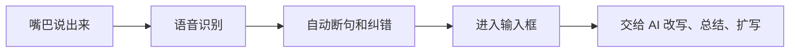
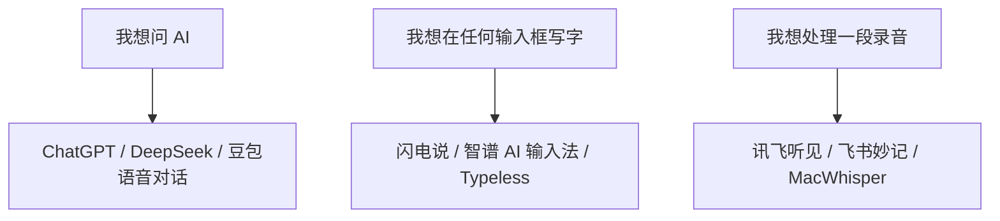
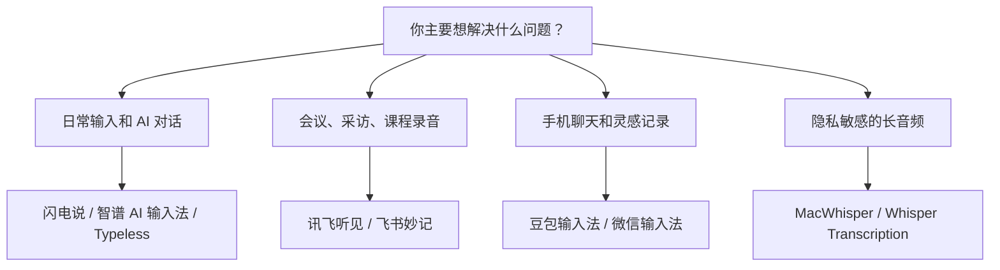

# 配图与素材清单

## 配图原则

这篇文章是工具横评，最好不要只放官网宣传图。

更适合用三类图：

1. 实测截图：自己在 Obsidian、AI 对话框、微信、飞书里使用语音输入的真实截图。
2. 功能截图：官网或软件界面中能说明核心差异的功能点。
3. 对比图：用简单图表说明“输入法 / AI 对话 / 录音转写”的区别。

## 建议配图

| 序号 | 放置位置 | 图片内容 | 备注 |
| --- | --- | --- | --- |
| 1 | 开头 | Obsidian + AI 对话窗口 + 麦克风浮窗 | 作为首图，最好用自己的桌面截图 |
| 2 | 闪电说段落 | 官网首屏或快捷键浮窗 | 突出“短按直接说 / 长按帮我说” |
| 3 | 智谱 AI 输入法段落 | 官网“你说，我写”页面 + Obsidian 实测 | 突出电脑端通用输入 |
| 4 | Typeless 段落 | Typeless 产品页或下载页 | 突出多平台、多语言 |
| 5 | 豆包输入法段落 | 手机语音输入实测截图 | 尽量选带方言或轻声输入的案例 |
| 6 | 微信输入法段落 | 微信聊天框语音转文字截图 | 突出轻量、低门槛 |
| 7 | 讯飞听见段落 | 转写结果页 | 突出角色、分段、摘要、导出 |
| 8 | 飞书妙记段落 | 会议纪要页 | 突出总结、待办、章节 |
| 9 | MacWhisper 段落 | 导入音频和转写结果界面 | 突出长音频和本地处理 |
| 10 | DeepSeek / ChatGPT 段落 | AI 语音对话界面 | 用来说明它是对话对象，不是通用输入法 |

## 可直接放进 Obsidian 的图表

### 图 1：语音输入的基本链路

### 图 2：三类工具不要混用

### 图 3：选型决策树

## 截图注意事项

- 不要截到私人聊天、公司会议内容、客户姓名。
- 如果截图里有真实文字，建议先用一段公开测试文本。
- 官网图可以做评论引用，但发布前最好标注来源或改用自己实测截图。
- 公众号首图建议自己做，不直接用软件官网主视觉。

