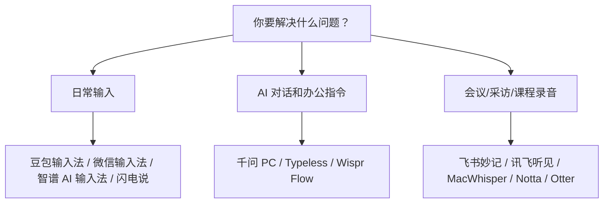
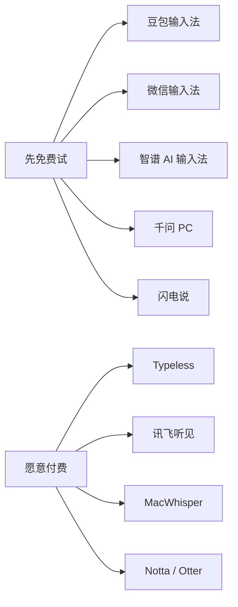
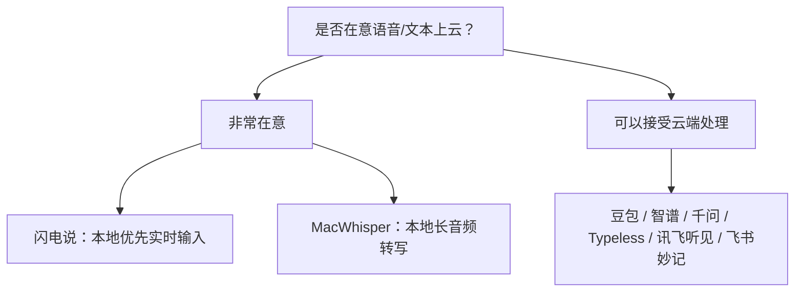

# 配图与素材清单

## 配图原则

这篇文章重点是帮读者选择工具，所以配图不要做成“软件宣传合集”。

建议三类图：

1. 价格/额度截图：截官网价格页或 App Store 内购信息。
2. 功能实测截图：自己在 Obsidian、AI 对话框、微信、飞书中试用语音输入。
3. 选择关系图：说明“日常输入 / AI 指令 / 会议转写”不是同一类工具。

## 建议配图

| 序号 | 放置位置 | 图片内容 | 重点 |
| --- | --- | --- | --- |
| 1 | 开头 | Obsidian + AI 对话框 + 麦克风浮窗 | 体现“说话变成文字” |
| 2 | 一张表后 | 工具选型总览图 | 手机输入、电脑输入、会议转写、隐私本地四类 |
| 3 | 豆包输入法 | 手机端语音输入实测或 App Store 评价截图 | 方言、轻声、中英混输 |
| 4 | 微信输入法 | 微信输入法语音输入界面或 App Store 功能页 | 免费、轻量、微信生态 |
| 5 | 智谱 AI 输入法 | 官网 FAQ 免费说明 + 桌面输入框实测 | 免费、电脑端、跨应用 |
| 6 | 千问 PC | 千问 PC 语音输入功能页或新闻截图 | 不只是输入法，是 AI 指令入口 |
| 7 | 闪电说 | 官网首屏或 GitHub 自荐帖截图 | 本地优先、隐私、低延迟 |
| 8 | Typeless | Typeless Pricing 截图 | 8000 words/week，Pro $12/月年付、$30/月月付 |
| 9 | Wispr Flow | Wispr Flow Pricing 截图 | 免费额度较少，英文场景 |
| 10 | 飞书妙记 | 飞书妙记权益公告或会议纪要页 | 免费版额度、飞书生态 |
| 11 | 讯飞听见 | App Store 内购页或收费说明页 | 按分钟收费、专业转写 |
| 12 | MacWhisper | 官网/转写界面截图 | 本地转写、一次性买断 |
| 13 | Notta / Otter | Notta Pricing 或 Otter Free 页 | 英文会议、免费额度限制 |

## 可直接放进 Obsidian 的图表

### 图 1：语音输入工具三分法

### 图 2：按预算选择

### 图 3：按隐私选择

## 截图注意事项

- 截价格页时要带上日期或在图注里写“查询时间：2026-06-14”。
- 不要截私人聊天、客户资料、会议内容。
- 软件评价截图不要截用户头像和昵称，或者做打码。
- 公众号首图建议自己做，不直接使用官网主视觉。
- 如果要做“价格对比图”，建议用自己整理的表格截图，避免官方价格变化导致误导。
