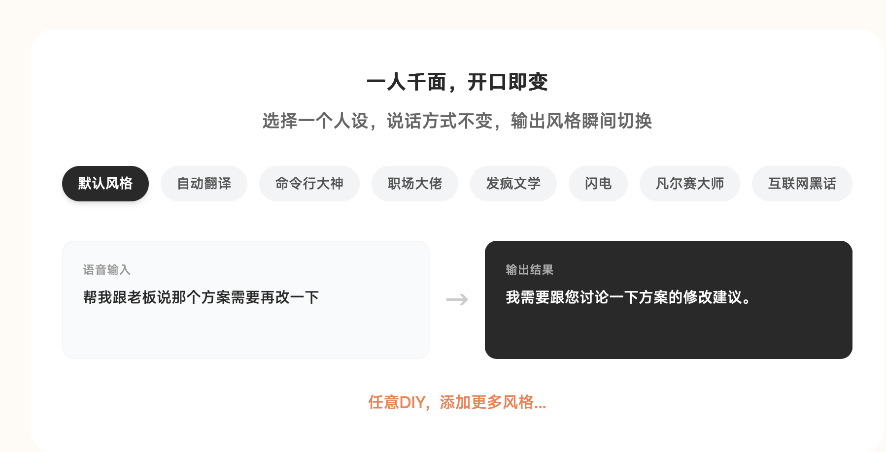
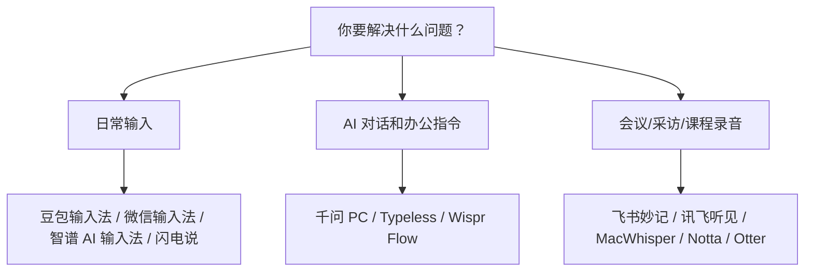

# AI 语音输入工具怎么选？别只看识别率，先看你要用它做什么

你有没有发现，和 AI 对话的时候，最慢的往往不是 AI。

而是我们打字的手。

脑子里已经想好了一段话。

手还在键盘上一个字一个字敲。

尤其是写公众号、改文案、做会议纪要、和 AI 来回追问的时候，这种感觉会特别明显。

所以这两年，我越来越觉得：语音输入不是一个“懒人工具”。

它更像是 AI 时代的新键盘。

但语音输入工具不能乱选。

因为它们看起来都叫“语音转文字”，实际解决的不是同一个问题。

有些适合中文聊天。

有些适合英文邮件。

有些适合会议采访。

有些主打本地运行和隐私。

如果只问“哪个识别率最高”，很容易选错。

这篇我按普通办公、自媒体写作和 AI 对话场景，把常见工具重新整理了一遍。

> 注：价格和免费额度以 2026 年 6 月 14 日公开页面为准，后续可能调整，购买前以官网为准。

## 先给结论

如果你只想先提高中文输入效率：

**豆包输入法 + 智谱 AI 输入法** 可以先试。

一个偏手机，一个偏电脑。

如果你每天都在和 AI 对话：

重点看 **千问 PC 语音输入、闪电说**。

它们不只是把声音变成文字，而是更接近“用语音驱动 AI 工作”。

如果你主要写英文邮件、跨语言沟通：

重点看 **Typeless**，预算低可以先试 **Wispr Flow** 免费版。

如果你要处理会议、采访、课程录音：

不要拿输入法硬撑，直接看 **飞书妙记、讯飞听见、MacWhisper**。

如果你最在意隐私：

重点看 **闪电说、MacWhisper**。

一个偏实时输入，一个偏长音频本地转写。

## 一张表先看懂

| 需求 | 优先试 | 免费情况 | 付费重点 | 判断 |
| --- | --- | --- | --- | --- |
| 手机中文输入 | 豆包输入法 / 微信输入法 | 核心输入能力免费 | 暂未查到独立语音订阅 | 中文、方言、日常聊天优先 |
| 电脑中文输入 | 智谱 AI 输入法 | 官方 FAQ 写明 AI 语音输入免费 | 暂未查到独立语音订阅 | 写稿、问 AI、办公输入适合先试 |
| AI 办公指令 | 千问 PC 语音输入 | 公开报道显示目前免费开放 | 暂未查到独立语音订阅 | 更像“说话让 AI 干活” |
| 隐私和本地 | 闪电说 | Basic 免费，支持本地语音模型和 API 密钥适配 | Pro 年付折算 ¥19.9/月，月付 ¥29/月；含直接说 10 小时/月、1000 Agent 积分/月 | 适合隐私敏感和电脑重度输入 |
| 英文/多语言 | Typeless | 免费 8000 words/week | Pro 年付 $12/月，月付 $30/月 | 英文邮件和表达整理强，价格不低 |
| 英文轻量尝试 | Wispr Flow | 桌面 2000 words/week，iPhone 1000 words/week | Pro 年付 $12/月，月付约 $15/月 | 英文场景可以试，中文谨慎付费 |
| 飞书会议 | 飞书妙记 | 基础免费版曾给 300 分钟/用户/月 | 商业版/企业版妙记转写不限 | 已经用飞书就很顺 |
| 专业转写 | 讯飞听见 | 录音和实时浏览免费 | 机器快转约 0.33 元/分钟，也有时长卡 | 采访、课程、长会议更合适 |
| 本地长音频 | MacWhisper | 免费版可用小模型 | 官网直购为一次性许可证，价格以结账页为准 | Mac 用户、隐私音频、长录音适合 |
| 英文会议 | Notta / Otter | Notta 免费 120 分钟/月；Otter 免费 300 分钟/月 | Pro 多为按月/年订阅 | 英文会议比中文写作更适合 |

## 怎么用

| 工具 | 下载/入口 |
| --- | --- |
| 豆包输入法 | [豆包输入法官网](https://shurufa.doubao.com/) |
| 微信输入法 | [微信输入法官网](https://z.weixin.qq.com/) |
| 智谱 AI 输入法 | [智谱 AI 输入法官网](https://autoglm.zhipuai.cn/autotyper/) |
| 千问 PC | [千问下载页](https://www.qianwen.com/download) |
| 闪电说 | [闪电说官网](https://shandianshuo.cn/) / [价格页](https://shandianshuo.cn/pricing) |
| Typeless | [Typeless 下载页](https://www.typeless.com/zh-cn/downloads) / [价格页](https://www.typeless.com/pricing) |
| Wispr Flow | [Wispr Flow 官网](https://wisprflow.ai/) / [价格页](https://wisprflow.ai/pricing) |
| 飞书妙记 | [飞书妙记官网](https://www.feishu.cn/product/minutes) |
| 讯飞听见 | [讯飞听见官网](https://www.iflyrec.com/) |
| MacWhisper | [MacWhisper 官网](https://goodsnooze.gumroad.com/l/macwhisper) |
| Notta | [Notta 官网](https://www.notta.ai/en) / [价格页](https://www.notta.ai/en/pricing) |
| Otter | [Otter 官网](https://otter.ai/) / [免费版说明](https://otter.ai/start-for-free) |

## 1. 豆包输入法：中文和方言，普通人可以先试它

豆包输入法适合手机端。

它的优势不是功能最复杂，而是中文语音输入比较顺。

方言、轻声输入、中英混输、语义纠错，这些都是它比较适合日常使用的地方。

很多人用语音输入，不可能每次都像播音员一样标准普通话。

有时候是在路上小声说。

有时候带一点口音。

有时候一句话里夹几个英文词。

这种情况下，豆包输入法的优势会比较明显。

免费能做什么：

- 日常语音输入。
- 中文、方言、中英混输。
- 聊天、灵感记录、短文本输入。

付费情况：

- 目前没有查到独立语音输入订阅价格。

适合谁：

- 手机重度用户。
- 方言用户。
- 经常在路上记录选题和灵感的人。

不适合谁：

- 需要处理一小时会议录音的人。
- 想自动生成完整会议纪要的人。

一句话建议：

**中文普通用户不知道先试哪个，就先试豆包输入法。**

## 2. 微信输入法：不是最强，但最容易坚持用

微信输入法的优势是低门槛。

它就在很多人的日常工作流里。

你不用重新学习复杂快捷键，也不用先研究一堆设置。

如果你只是微信聊天、发朋友圈、写几句短内容，它已经够用。

但它的问题也很明显：

它不是为长文写作设计的。

它可以帮你把话输入进去，但不会把你的口语整理成特别漂亮的书面表达。

免费能做什么：

- 语音输入。
- 常用语、剪贴板等日常输入能力。
- 轻量问 AI。

付费情况：

- 目前没有查到独立语音输入订阅价格。

适合谁：

- 不想折腾新工具的人。
- 主要在微信生态里沟通的人。

不适合谁：

- 把语音输入当主力写作工具的人。
- 想要强 AI 改写和风格整理的人。

一句话建议：

**它不是最强，但可能是最容易每天用起来的。**

## 3. 智谱 AI 输入法：电脑端中文语音输入，值得先试

> 智谱 AI 输入法官网展示的“一人千面，开口即变”：选择人设后，说话方式不变，输出风格可以快速切换。

智谱 AI 输入法更适合电脑。

它的官方 FAQ 写得很直接：AI 语音输入功能全面免费开放。

这点对普通用户很友好。

因为很多人第一次尝试语音输入，并不确定自己能不能坚持用。

如果一上来就是高价订阅，很容易劝退。

智谱 AI 输入法适合在电脑上写文档、写公众号、和 AI 对话。

它的价值不是替你写文章，而是减少“想法到文字”中间的摩擦。

它还有一个很适合运营和职场沟通的功能：**人设和风格切换**。

官网示例里，你可以选择“默认风格、自动翻译、命令行大神、职场大佬、发疯文学、闪电、凡尔赛大师、互联网黑话”等风格。

同一句口语输入，输出可以变成更正式、更职场、更口语化，或者更适合某个沟通场景的表达。

这对运营人很有用。

因为很多时候，我们不是不知道要说什么，而是不知道这句话应该用什么语气发出去。

免费能做什么：

- AI 语音输入。
- 电脑端跨输入框使用。
- 用在微信、飞书、Word、代码编辑器等场景。
- 选择人设和输出风格，把口语转成不同场景下更合适的表达。

付费情况：

- 暂未查到独立语音输入订阅。

适合谁：

- Mac / Windows 上高频输入的人。
- 经常写稿、写文档、问 AI 的人。
- 想先免费试水的人。

不适合谁：

- 只在手机上输入的人。
- 完全不想登录或使用云端服务的人。

一句话建议：

**电脑端中文语音输入，智谱是一个很适合先试的免费选项；如果你经常写运营话术、客户回复、职场沟通，它的人设/风格切换尤其值得试。**

## 4. 千问 PC 语音输入：更像“说话让 AI 干活”

千问 PC 语音输入和普通输入法不太一样。

普通输入法解决的是：

你说一句，它打一句。

千问更接近：

你说一个任务，它帮你整理、回复、解释、翻译，甚至继续调用 AI 处理。

比如你可以说：

“帮我把这段话改得适合发给客户。”

或者：

“把这段会议内容整理成三个待办。”

这时候，它就不是单纯输入法，而是一个 AI 办公入口。

免费能做什么：

- 公开报道显示，目前 PC 语音输入功能免费开放。
- 支持语音输入、去语气词、纠错、格式化整理。
- 可以把语音变成 AI 指令。

付费情况：

- 暂未查到独立语音输入订阅。

适合谁：

- 经常让 AI 改写、总结、回复消息的人。
- 想在 Word、浏览器、微信、邮件里直接用 AI 的人。

不适合谁：

- 只想要一个简单输入法的人。
- 对新功能稳定性要求很高、不想尝鲜的人。

一句话建议：

**如果你每天都在和 AI 对话，千问 PC 语音输入值得重点试。**

## 5. 闪电说：本地优先，隐私敏感的人要重点看

> 这张是闪电说语音输入时的悬浮窗截图，交互很轻，核心就是“直接说”。

> 闪电说官网价格页显示：Basic 免费；Pro 年付折算 ¥19.9/月，月付 ¥29/月；Max 暂未发布。

闪电说最值得注意的点，不是它也能语音转文字。

而是它强调端侧优先、本地模型运行。

也就是说，它更关注一件事：

你的声音尽量在本机处理，而不是先上传到云端。

这对隐私敏感的人很重要。

比如你经常输入客户资料、内部文档、未发布选题，输入法是否上传音频，就不只是体验问题，而是边界问题。

它的另一个特点是轻。

从这张“直接说”的悬浮窗也能看出来，它不是一个很重的工作台，更像一个随时唤起的语音入口。

但本地模型也有代价。

有些评测提到，闪电说速度很爽，但遇到中英文混排、专有名词、说话太快时，准确率可能不如更大的云端模型。

免费能做什么：

- Basic 免费。
- 本地语音模型。
- 主流厂商 API 密钥适配。
- 自定义模型能力，包括自定义语音识别模型、快速大模型和高级大模型。

付费情况：

- Pro 年付折算 ¥19.9/月，¥238.8/年。
- Pro 月付 ¥29/月。
- Pro 包含“高级功能登录即用，无需密钥”。
- Pro 包含“直接说 10 小时/月”，并包含闪电说语音识别和快速大模型。
- Pro 包含 1000 Agent 执行积分/月，用于“帮我说”。
- Pro 包含实验室功能抢先体验、优先客服支持。
- 如果需要更多用量，官网价格页显示可以购买加量包，例如“直接说 10 小时”¥20，“Agent 执行 1000 积分”¥20。
- Max 版本显示“即将发布”，含直接说 50 小时/月和 5000 Agent 执行积分/月。

适合谁：

- 电脑端重度输入。
- 隐私敏感。
- 希望尽量本地处理语音的人。
- 经常写作、问 AI、回复消息的人。

不适合谁：

- 对中英混输、专有名词准确率要求极高的人。
- 不想接受新工具稳定性波动的人。

一句话建议：

**如果你在意隐私，Basic 就值得试；如果你想少折腾密钥、直接用高级功能，Pro 的价格也不算高。**

## 6. Typeless：英文和多语言很强，但中文用户不一定要买

Typeless 的核心价值，不是便宜。

它强在英文、多语言、邮件和表达整理。

它不是简单把语音转成文字，而是希望把你说出来的口语，整理成更像可以直接发送的文字。

这对英文办公很有价值。

比如写邮件、回客户、跨语言沟通。

但如果你主要写中文公众号，Typeless 不一定是第一选择。

因为中文场景里，豆包、智谱、千问、闪电说这些工具已经能覆盖不少需求。

而 Typeless 的价格并不低。

免费能做什么：

- 免费 8000 words/week。
- 标准准确率。

付费买到什么：

- Pro 年付 $12/月。
- 月付 $30/月。
- 无限字数、增强准确率、优先访问等能力。

适合谁：

- 英文邮件。
- 海外客户沟通。
- 中英混合、多语言办公。
- 希望把口语整理成正式表达的人。

不适合谁：

- 只写中文。
- 预算敏感。
- 对云端处理很介意。

一句话建议：

**Typeless 很好，但更适合愿意为英文和多语言表达质量付费的人。**

## 7. Wispr Flow：英文办公可以试，中文场景谨慎付费

Wispr Flow 在海外语音输入工具里讨论度很高。

它适合英文办公，比如 Slack、Gmail、Docs、ChatGPT 这些场景。

但中文用户要谨慎。

一些用户评价提到，它的中文识别和表达还原不一定稳定。

如果你的主要场景是中文写作、中文聊天，免费的豆包输入法、智谱 AI 输入法，可能更值得先试。

免费能做什么：

- 桌面端 2000 words/week。
- iPhone 1000 words/week。

付费买到什么：

- Pro 年付 $12/月。
- 月付约 $15/月。
- 更高额度和更多功能。

适合谁：

- 英文办公。
- 海外团队沟通。
- 已经在英文工作流里的人。

不适合谁：

- 中文为主。
- 预算敏感。
- 希望本地离线处理的人。

一句话建议：

**英文场景可以试，中文场景不要先付费。**

## 8. 飞书妙记：已经用飞书的人，会议纪要很顺

飞书妙记适合会议。

它的优势不是单纯转写，而是和飞书会议、文档、任务、团队协作打通。

如果你的团队本来就在飞书里开会，会议结束后直接生成纪要、待办、逐字稿，这件事会很自然。

但如果你只是个人写公众号，它不是第一选择。

它更适合把“开过的会”变成“可搜索、可分发、可追踪的内容”。

免费能做什么：

- 飞书基础免费版曾给到 300 分钟/用户/月妙记转写时长。

付费买到什么：

- 商业版/企业版妙记转写不限。
- AI 会员和智能纪要可能有额外额度规则。

适合谁：

- 飞书重度用户。
- 团队会议多的人。
- 需要会后纪要和待办沉淀的人。

不适合谁：

- 单纯写文章。
- 不在飞书生态办公的人。

一句话建议：

**已经用飞书，它就是会议纪要首选；不用飞书，就不用为了妙记专门迁移。**

## 9. 讯飞听见：专业转写成熟，但要按分钟算账

讯飞听见不是输入法。

它是录音转写工具。

这点要分清楚。

如果你要处理采访、课程、演讲、长会议，它比普通输入法合适。

因为这类场景要的不只是“把声音变成字”。

还要分段、回听、导出、整理、甚至人工精转。

讯飞听见的能力成熟，但长期使用要算成本。

免费能做什么：

- 录音免费。
- 录音过程中的实时转文字和翻译浏览免费。

付费买到什么：

- 分享或下载转文字内容需要收费。
- 机器快转约 0.33 元/分钟。
- App 内也有 10 分钟、30 分钟、1 小时等时长卡。

适合谁：

- 采访录音。
- 课程整理。
- 长会议转写。
- 需要导出 Word、字幕或精转的人。

不适合谁：

- 日常聊天输入。
- 和 AI 对话时即时输入。
- 不想按分钟付费的人。

一句话建议：

**讯飞听见用在采访和会议上才值，不适合拿来替代输入法。**

## 10. MacWhisper：Mac 用户处理隐私录音，可以单独考虑

MacWhisper 和前面这些输入法不一样。

它更像一个本地音频转写工作台。

你把音频文件放进去，它帮你转成文字。

它适合长音频，也适合隐私敏感内容。

比如访谈录音、播客、内部会议录音、还没发布的内容素材。

它的价值不在“随处输入”，而在“本地处理”。

免费能做什么：

- 免费版通常可以用较小模型做本地转写。

付费买到什么：

- 官网直购为一次性许可证。
- 具体价格建议以结账页为准。
- Pro 通常解锁更大模型和更多高级能力。

适合谁：

- Mac 用户。
- 经常处理长音频的人。
- 不想把音频上传云端的人。

不适合谁：

- Windows 用户。
- 想在微信、Obsidian、AI 对话框里随处输入的人。
- 不想研究模型和导入导出流程的人。

一句话建议：

**如果你有 Mac，又经常处理敏感录音，MacWhisper 很值得看。**

## 11. Notta / Otter：更适合英文会议，不是中文写作首选

Notta 和 Otter 更偏会议转写。

尤其是英文会议、国际团队、跨平台会议记录。

如果你主要做中文公众号写作，它们不是第一选择。

但如果你经常开英文会议，或者需要跨平台记录会议内容，可以放进备选。

免费能做什么：

- Notta 免费 120 分钟/月，但单次时长有限制。
- Otter 免费 300 分钟/月，单次 30 分钟。

付费买到什么：

- Notta Pro 年付 $8.17/月。
- Otter Pro 年付约 $8.33/月。
- 更长时长、更高额度和更多导出能力。

适合谁：

- 英文会议。
- 海外团队。
- 国际协作。

不适合谁：

- 中文写作。
- 中文聊天输入。
- 只想提高日常输入速度的人。

一句话建议：

**英文会议可以看，中文自媒体写作不用优先考虑。**

## 最后，怎么选最简单？

如果你是普通中文用户：

先试 **豆包输入法 + 智谱 AI 输入法**。

一个解决手机输入，一个解决电脑输入。

如果你是 AI 重度用户：

试 **千问 PC 语音输入**。

它不只是输入，还能把语音变成 AI 指令。

如果你最在意隐私：

试 **闪电说 + MacWhisper**。

一个偏实时输入，一个偏本地长音频转写。

如果你做英文办公：

试 **Typeless**。

预算低，先试 **Wispr Flow** 免费版。

如果你做采访和会议：

个人轻量先试 **飞书妙记**。

专业转写、导出、人工精转，再看 **讯飞听见**。

不要追求一个工具解决所有问题。

语音输入至少分三类：

如果只是聊天和日常办公，没必要一上来买 Typeless。

如果只是偶尔转一次会议，也没必要折腾本地模型。

如果你每天都写稿、问 AI、整理访谈，那语音输入就不是小工具了。

它会变成你的新键盘。

真正要选的不是“哪个识别率最高”。

而是：

你的声音，最后要去哪里。

是进入聊天框。

进入 AI 对话框。

还是进入一份会议纪要。

这个问题想清楚了，工具就很好选。

我是 **黎子**，专注 **AI+运营** 提效。每天进步一点点，让 AI 为你打工。关注我，争取早日退休。
