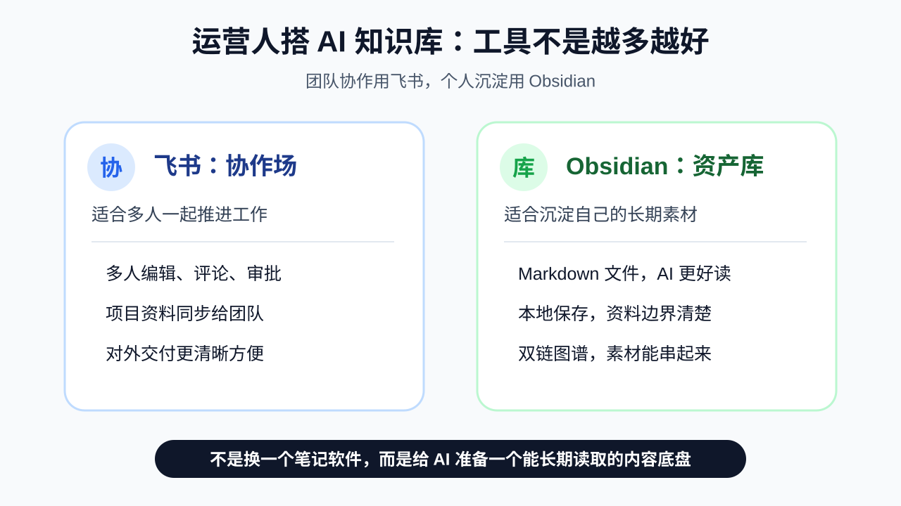

# 运营人搭 AI 知识库，为什么我更建议先用 Obsidian？

很多运营人不是没有资料。

恰恰相反。

资料太多了。

微信群里有用户反馈。

飞书里有项目文档。

收藏夹里有行业文章。

手机相册里有截图。

网盘里有课件。

公众号后台里还有发布数据。

看起来什么都有。

但真正要写文章、做选题、复盘活动、让 AI 帮你生成内容时，问题就来了：

你明明看过很多东西。

但想不起来。

你明明收藏过很多资料。

但找不到。

你明明做过很多项目。

但下一次还是像从零开始。

这不是因为你不努力。

而是因为资料还没有变成资产。

## 一、飞书很好，但它更像协作场

先说清楚。

飞书很好用。

如果你要和团队一起写方案、改文档、评论、@同事、同步项目进度，飞书很合适。

它的优势是协作。

但个人 AI 知识库，重点不是协作。

而是沉淀。

你要沉淀自己的选题、素材、历史文章、用户反馈、发布数据、写作风格和复盘记录。

这些东西不一定每天都要给别人看。

但它们会决定 AI 以后能不能真正帮到你。

所以我更建议：

团队协作用飞书。

个人沉淀用 Obsidian。

## 二、为什么 Obsidian 更适合做个人 AI 知识库？

不用讲太复杂。

核心就三点。

### 1. Markdown 文件，AI 更好读

Obsidian 的笔记是 Markdown 文件。

你可以理解成“有格式的纯文本”。

标题、列表、链接都能保留，但底层还是文本。

这对 AI 很友好。

因为 AI 最擅长读清晰的文本。

一篇文章可能只有几 KB。

读取快。

复制方便。

以后不用 Obsidian，也可以用别的 Markdown 工具打开。

它不是被锁在某一个云文档平台里的内容。

这点对运营人很重要。

因为你的知识库不是只用一天。

它要陪你写很多篇文章，做很多次复盘，沉淀很多年的内容经验。

### 2. 本地保存，资料边界更清楚

Obsidian 的知识库，本质上是你电脑里的一个文件夹。

你的素材在哪里，你看得见。

你的文章在哪里，你找得到。

你的复盘在哪里，你能长期保存。

对于运营人来说，很多资料其实不适合随便散落在各种云端工具里。

比如用户私信、社群聊天、活动复盘、转化话术、还没发布的选题。

这不是说云端工具不安全。

而是你的核心内容资产，最好自己也有一份本地底稿。

能协作的，可以放飞书。

需要长期沉淀的，放 Obsidian 更踏实。

### 3. 双链和图谱，能把素材串起来

运营最怕的不是没有素材。

而是素材之间没有关系。

一个用户评论，可以变成一个痛点。

一个痛点，可以变成一个选题。

一个选题，可以变成一篇文章。

一篇文章发布后，数据又可以反过来更新你的选题判断。

Obsidian 的双链和图谱，适合把这些关系留下来。

你会慢慢看到：

哪些主题是你经常写的。

哪些素材可以组合。

哪些用户问题反复出现。

哪些内容正在形成你的账号特色。

这不是为了好看。

而是为了让你的素材能被反复使用。

## 三、运营人为什么更需要自己的知识库？

因为运营工作太容易被打散了。

今天写文案。

明天做活动。

后天看数据。

大后天回复用户。

每天都在处理信息，但很多经验没有留下来。

没有留下来，就只是经历。

留下来，才会变成资产。

AI 也一样。

AI 不缺通用知识。

它缺的是你的业务上下文。

你的用户是谁。

你的读者为什么关注你。

你的账号适合写什么。

你的内容哪些有效，哪些无效。

这些东西，网上没有。

只有你自己的知识库里有。

所以运营人搭 Obsidian，不是为了显得专业。

而是为了让 AI 读到你的真实素材、真实判断和真实复盘。

## 四、最小知识库怎么开始？

不用一上来搭很复杂。

先建四个文件夹就够了。

第一个，选题库。

放你想写、可能写、值得观察的选题。

第二个，素材库。

放用户反馈、行业案例、竞品内容、历史文章、观点摘录。

第三个，稿件库。

每一篇文章建一个独立文件夹，把访谈记录、大纲、初稿、改稿、定稿都放进去。

第四个，数据复盘库。

每篇内容发布后，把阅读、点赞、收藏、评论、关注变化记录下来。

以后你再让 AI 写文章，就不要只丢一句话。

而是把相关选题、素材、历史文章、风格报告一起给它。

这样 AI 才会越来越懂你。

输出也才会越来越不像模板。

## 五、不是换工具，而是搭内容底盘

很多人一听 Obsidian，就觉得又要学一个新工具。

其实重点不是换工具。

重点是建立自己的内容底盘。

飞书适合团队协作。

Obsidian 适合个人沉淀。

Word 适合正式交付。

不同工具做不同的事。

你真正要做的，是把每天看到的资料、做过的项目、收到的反馈、发布后的数据，慢慢沉淀下来。

信息不沉淀，就只是噪音。

素材不连接，就只是碎片。

复盘不写下来，就只是感觉。

AI 没有你的真实资料，就只能写出很普通的内容。

所以，我更建议运营人从 Obsidian 开始搭个人 AI 知识库。

不是因为它最酷。

而是因为它足够轻、足够开放、足够适合长期保存，也足够适合让 AI 读取。

你不是在整理文件。

你是在给未来的自己，搭一个越来越懂你的内容系统。

